# Các flow nghiệp vụ quan trọng

> Quy ước: mọi đường dẫn bên dưới đã bao gồm prefix thực tế `/api`. `DB` là PostgreSQL qua Prisma. Các API không có `@Public()` đều đi qua JWT/session trước controller.

## 1. Flow đăng ký Attendee/Organizer

**File cần mở:** `backend/src/modules/auth/auth.controller.ts`, `auth.service.ts`, `dto/register.dto.ts`, `app/src/app/auth/register.tsx`.

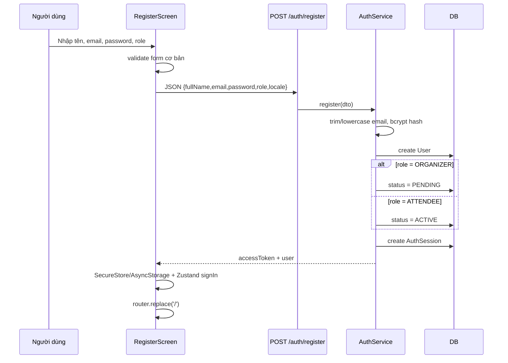

Điểm cần nói:

- Chỉ `ATTENDEE` và `ORGANIZER` có trên form. `SCANNER` do organizer tạo device; `ADMIN` được seed/quản trị hệ thống, không tự đăng ký.
- Organizer vẫn nhận token sau register nhưng có `status=PENDING`; `RolesGuard` chặn thao tác role-protected cho đến admin chuyển `ACTIVE`.
- Email được lowercase trước create; unique database bảo vệ race đăng ký trùng. Prisma `P2002` map thành `EMAIL_ALREADY_REGISTERED`.

## 2. Flow login, session và logout

**File cần mở:** `AuthService.login`, `AuthService.buildSession`, `JwtStrategy.validate`, `auth-store.ts`.

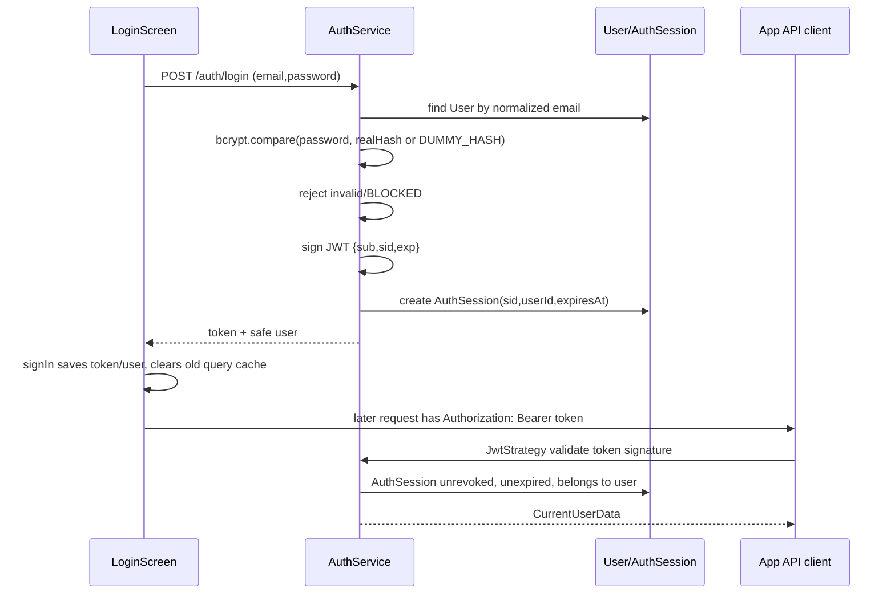

Logout `POST /auth/logout` chỉ revoke `AuthSession` hiện tại. `signOut()` phía app vẫn xóa local token/cache dù request logout fail, để offline user luôn thoát local được.

Đổi password (`PATCH /auth/password`) verify password cũ, hash password mới, rồi revoke tất cả session khác trong một transaction. Session hiện tại được giữ để user không bị đá ra ngay.

## 3. Flow tạo scanner device và kết nối thiết bị

**File cần mở:** `StaffService.createDevice`, `StaffService.reconnect`, `AuthService.staffConnect`, `app/src/app/auth/staff-connect.tsx`.

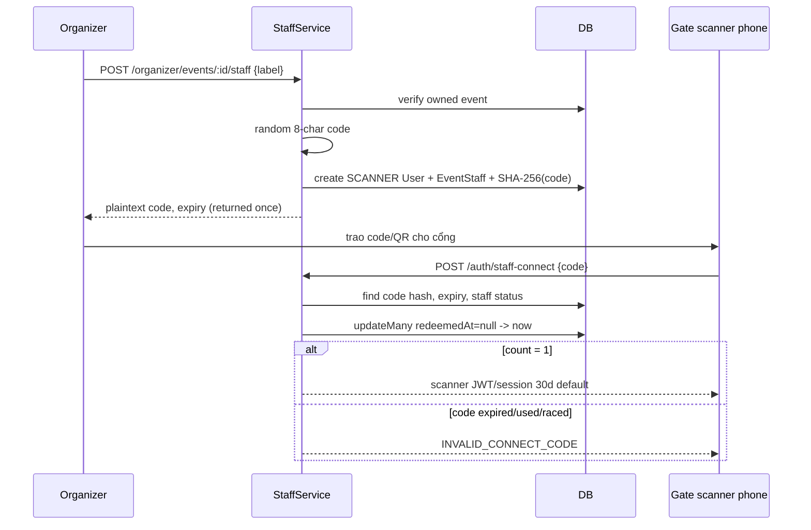

Code không lưu plaintext, chỉ hash. `updateMany({ redeemedAt: null })` là single-use guard: hai máy nhập cùng mã thì chỉ một máy nhận session.

## 4. Flow Organizer tạo event, hạng vé và gửi duyệt

**File cần mở:** `app/src/components/organizer/event-form.tsx`, `events/new.tsx`, `EventsOrganizerService`, `UploadsService`.

```mermaid
sequenceDiagram
  participant O as Organizer app
  participant E as EventsOrganizerService
  participant U as UploadsService/Cloudinary
  participant D as DB
  participant N as Notification

  O->>E: POST /organizer/events
  E->>E: validate startAt < endAt
  E->>D: create Event status DRAFT
  E-->>O: event detail
  opt chọn cover
    O->>U: signature -> direct Cloudinary upload -> complete
    U->>D: save coverImageUrl only when event DRAFT
  end
  O->>E: POST/PATCH ticket-types
  E->>D: lock event FOR UPDATE; require DRAFT
  E->>E: validate sales window / reserved quantity
  E->>D: create/update/delete TicketType
  O->>E: POST /organizer/events/:id/publish
  E->>D: lock Event, require DRAFT + >=1 ticket type
  E->>D: DRAFT -> PENDING_REVIEW
  E->>D: create EVENT_SUBMITTED notifications for active admins
```

`publish` là tên endpoint cũ nhưng ý nghĩa nghiệp vụ là **submit for review**, chưa public ngay. Khi thuyết trình nên nói rõ điều này để tránh bị hỏi.

Chỉ event `DRAFT` được edit cover, event fields và ticket type. `lockEditableEvent()` khóa row event trước khi sửa ticket type để publish và edit không chạy lẫn nhau.

## 5. Flow Admin duyệt event, nổi bật, ẩn/khôi phục

**File cần mở:** `AdminController`, `AdminService.approveEvent`, `updateEventFeatured`, `hideEvent`, `unhideEvent`; app `admin/(tabs)/events.tsx`.

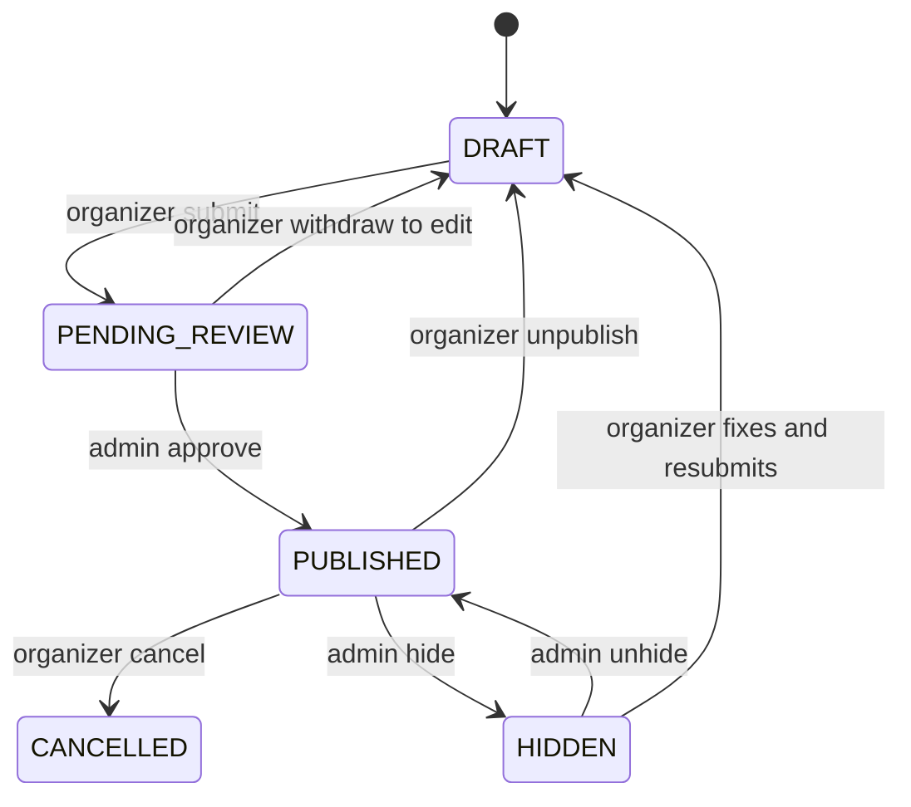

### 5.1 Approve

1. Admin app gọi `POST /admin/events/:id/approve`.
2. `RolesGuard` yêu cầu admin active.
3. `AdminService` đọc event, chỉ cho `PENDING_REVIEW`.
4. `updateMany` với điều kiện status `PENDING_REVIEW` chuyển sang `PUBLISHED`.
5. Tạo `EVENT_APPROVED` notification cho organizer trong cùng transaction.

Nếu một admin khác vừa xử lý, `count !== 1` trả `INVALID_STATE_TRANSITION`, tránh duyệt hai lần.

### 5.2 Featured

`PATCH /admin/events/:id/featured` chỉ cho set `featured=true` khi event đang `PUBLISHED`. Khi đánh dấu nổi bật, organizer nhận `EVENT_FEATURED`. Organizer không có endpoint set featured.

### 5.3 Hide

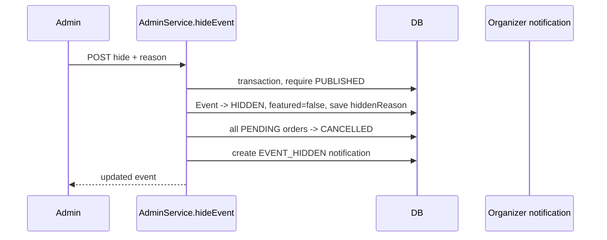

Hủy pending order giúp release inventory ngay. Nếu tiền chuyển đến sau khi event bị hide, payment sẽ rơi vào manual review, không tự cấp ticket cho event đã bị ẩn.

## 6. Flow khám phá và đặt vé

**File cần mở:** `EventsService.findAll/findOne`, `app/src/app/(attendee)/index.tsx`, `app/src/lib/discovery.ts`, `app/src/app/event/[id].tsx`.

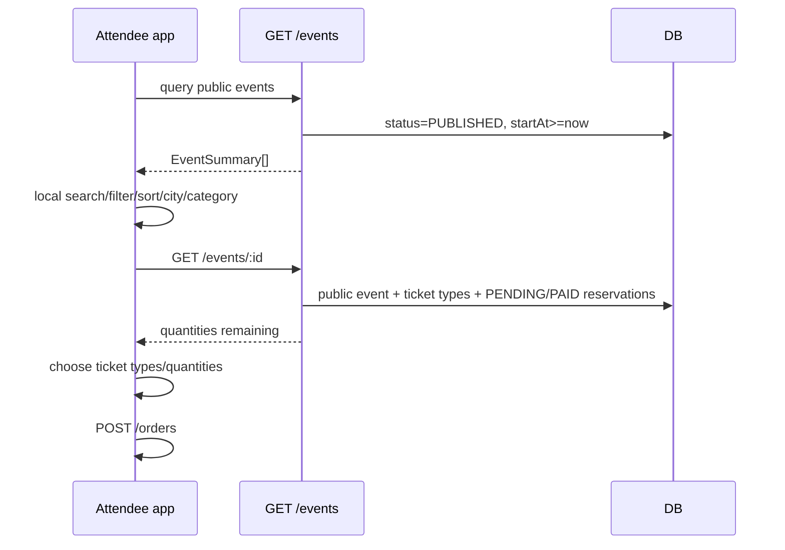

Backend `findAll` có hỗ trợ search/city/category/featured; màn Discovery hiện gọi lấy danh sách rồi thực hiện nhiều filter/sort cục bộ để tạo section Featured/This week/Free và phản hồi UI nhanh.

`EventsService.findOne()` tính `quantityRemaining = quantityTotal - sum(PENDING, PAID)`. Tính lại phía server là cần thiết vì app có thể stale ngay lúc đặt.

## 7. Flow tạo order và chống oversell

**File cần mở:** `OrdersService.create`, `CreateOrderDto`, `OrdersController`.

```mermaid
sequenceDiagram
  participant A as Attendee app
  participant O as OrdersService
  participant D as PostgreSQL

  A->>O: POST /orders {eventId, items, clientRequestId?}
  O->>O: merge duplicate ticketType lines
  O->>D: BEGIN + lock buyer row
  O->>D: if clientRequestId exists, return existing order
  O->>D: read event, require PUBLISHED
  O->>D: lock requested TicketType rows ordered by id
  O->>D: aggregate reservations PENDING + PAID
  O->>O: reject SOLD_OUT if requested > available
  O->>O: calculate total from DB prices
  alt total = 0
    O->>D: create PAID order/items/tickets/notification
  else total > 0
    O->>D: count current unexpired PENDING for buyer
    O->>O: reject at max 3
    O->>D: create PENDING order/items, expiresAt=now+holdMinutes
  end
  O->>D: COMMIT
  O-->>A: order; pending includes VietQR payment info
```

Các invariant cần học:

- Không tin price app gửi: total tính từ `TicketType.priceVnd` database.
- PENDING là giữ chỗ, nên được tính như PAID để không oversell.
- Max 3 pending order là theo buyer và được lock trên `User` row để concurrent request không lách limit.
- `clientRequestId` + unique DB bảo vệ retry do mạng chập chờn.
- Free order cấp ticket ngay trong transaction; paid order chưa tạo ticket trước webhook.

## 8. Flow thanh toán VietQR / SePay webhook

**File cần mở:** `OrdersService.buildPayment`, `PaymentsController`, `PaymentsService.handleSepayWebhook`, `OrdersExpiryService`.

```mermaid
sequenceDiagram
  participant A as App
  participant B as Orders API
  participant S as SePay
  participant P as PaymentsService
  participant D as DB

  A->>B: create paid order
  B-->>A: bank/account/amount/transferCode/qrImageUrl/expiresAt
  Note over A,S: User transfers exact amount with transferCode
  S->>P: webhook(id, code, transferAmount, content)
  P->>P: constant-time API key check; idempotency by sepayTxnId
  P->>D: find transferCode + verify amount
  alt PENDING and not expired
    P->>D: guarded PENDING -> PAID
    P->>D: create Tickets + MATCHED Payment + TICKET_ISSUED notification
    P-->>S: success
    P->>P: queue email after commit
  else mismatch/late/cancelled/expired
    P->>D: record UNMATCHED or REVIEW_REQUIRED
    P->>D: notify admins for review when required
    P-->>S: success; no ticket
  end
```

### Race webhook vs expiry/cancel

- Cron only updates order if still `PENDING` and expired.
- Webhook only marks `PAID` if still `PENDING` and not expired.
- User cancel only updates if still unexpired `PENDING`.

Ba hành động dùng condition trong `WHERE`; một action thắng, action còn lại thấy 0 row và không overwrite trạng thái hợp lệ.

## 9. Flow pending order, hủy đơn và xem lại thanh toán

**File cần mở:** `orders/pending`, `OrdersService.cancelPending`, `app/src/app/(attendee)/tickets.tsx`, `app/src/app/order/[id].tsx`.

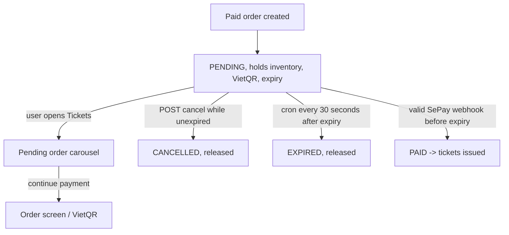

Attendee screen poll pending orders mỗi 4 giây khi còn đơn để cập nhật countdown/payment state. Cancel mutation cập nhật cache local rồi invalidate lại để nhận state server thật.

## 10. Flow cấp vé, hiển thị QR và lưu ảnh vé

**File cần mở:** `TicketsService.issue`, `TicketSignerService`, `TicketsController`, `app/src/components/ticket/ticket-qr.tsx`, `ticket-image-card.tsx`, `tickets.tsx`.

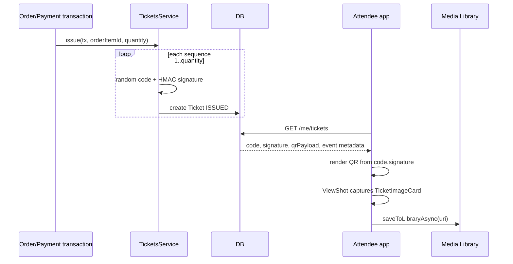

`ViewShot` không tạo QR hay cấp ticket; nó chụp UI đã render để tạo ảnh lưu máy. `expo-media-library` là API xin quyền và lưu ảnh vào thư viện thiết bị.

## 11. Flow check-in QR và realtime dashboard

**File cần mở:** `CheckinController`, `CheckinService.resolve`, `EventStaffGuard`, `CheckinGateway`, `scanner/scan/[eventId].tsx`, `organizer/events/[id].tsx`.

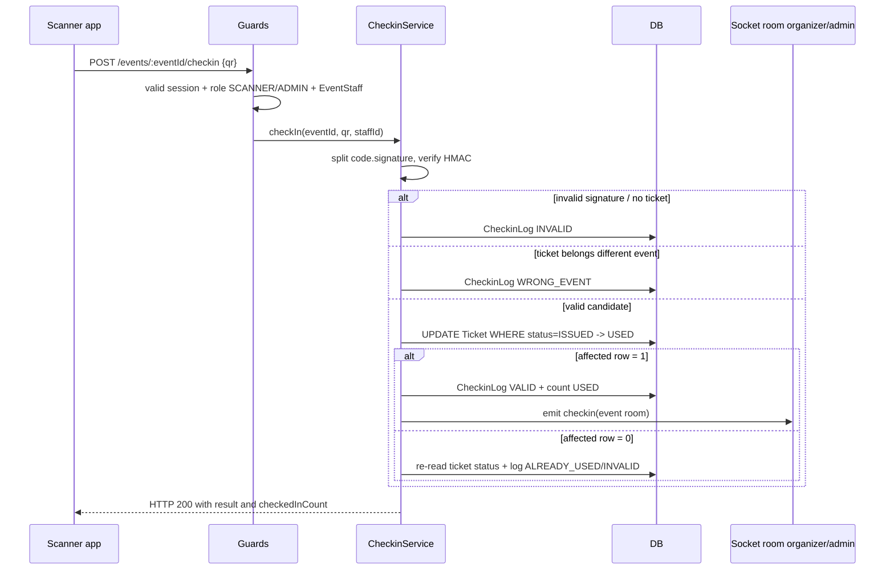

Tất cả kết quả business (`VALID`, `ALREADY_USED`, `INVALID`, `WRONG_EVENT`) trả HTTP 200. HTTP 4xx/5xx được dành cho request/auth/system errors. Cách này giúp scanner xử lý outcome ở UI như trạng thái nghiệp vụ, không coi ticket đã dùng là API crash.

`WHERE status='ISSUED'` là điểm quyết định exactly one valid scan khi hai cổng quét cùng QR.

## 12. Flow notification in-app

**File cần mở:** `NotificationsService`, `notification-center-screen.tsx`, layouts tabs.

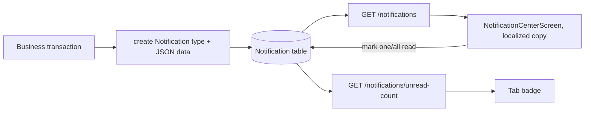

Notification được tạo trong transaction của event approval, ticket issuance, payment review, withdrawal… để tránh event đổi thành công nhưng không có notification tương ứng.

## 13. Flow doanh thu và xuất CSV

**File cần mở:** `StatisticsService`, `StatisticsController`, `RevenueReportDialog`, `revenue-report-file.ts`.

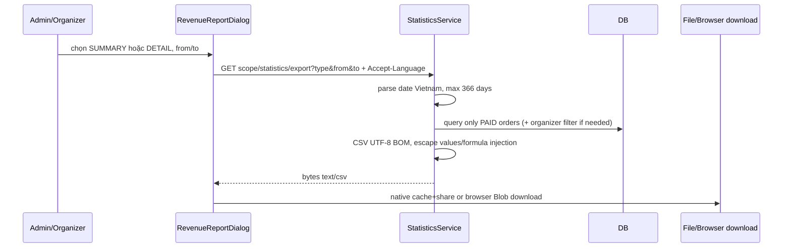

Admin scope là toàn nền tảng; organizer scope có filter `event.organizerId = current user`, không thể pass organizer id từ client để xem dữ liệu người khác.

## 14. Flow rút tiền organizer

**File cần mở:** `WithdrawalsService`, two withdrawal controllers, screens organizer/admin withdrawals.

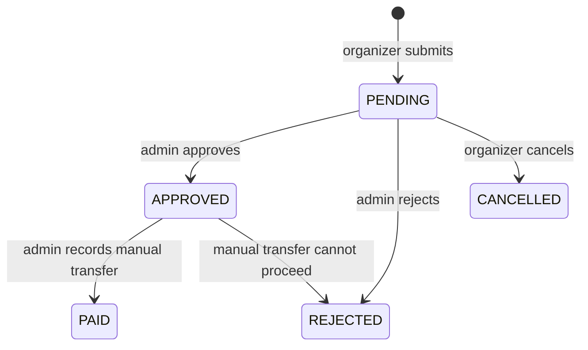

```mermaid
sequenceDiagram
  participant O as Organizer
  participant S as WithdrawalsService
  participant D as DB
  participant A as Admin

  O->>S: GET balance
  S->>D: sum PAID orders of ended events - open requests - paid withdrawals
  O->>S: POST request bank snapshot + amount
  S->>D: lock organizer user; one open request; min/available balance
  S->>D: create PENDING request + notify active admins
  A->>S: approve/reject/mark-paid
  S->>D: CAS state transition + organizer notification
```

Revenue only withdrawable after event `endAt` đã qua. Platform không tự gọi ngân hàng; `mark-paid` ghi nhận admin đã chuyển thủ công, có reference/note tùy chọn.

## 15. Flow upload avatar/cover

**File cần mở:** `app/src/lib/api/uploads.ts`, `UploadsService`, `ImagePickerField`.

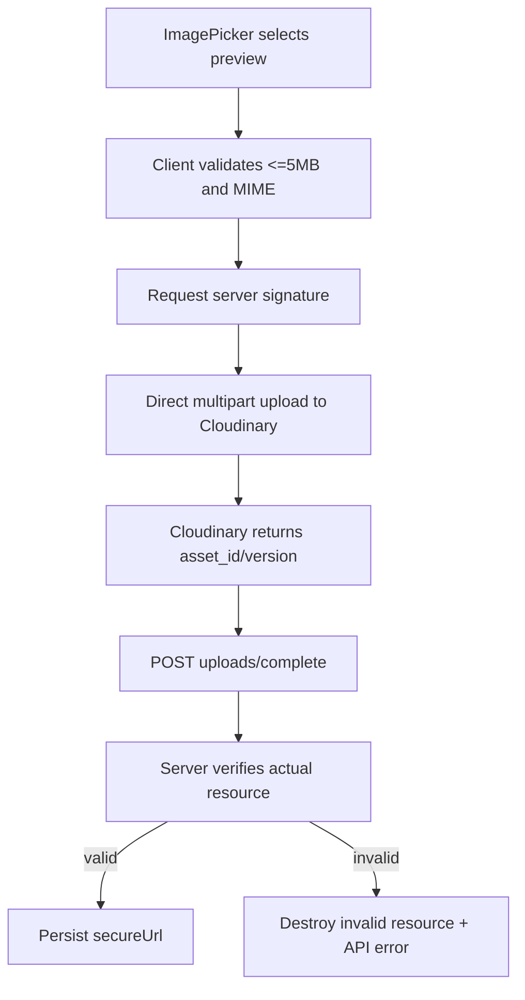

Event cover authorization lặp lại ở signature, complete và delete; complete/delete dùng `updateMany` with `status=DRAFT` để không đổi cover một event vừa được gửi duyệt.
