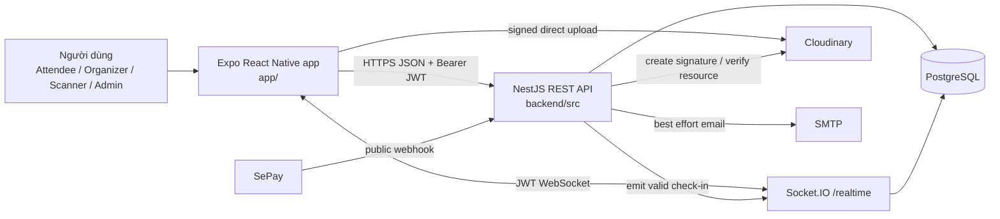
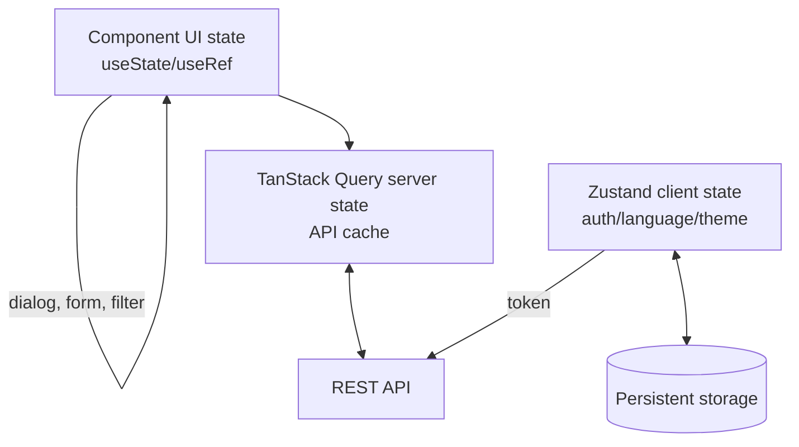
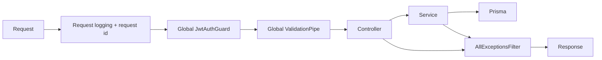
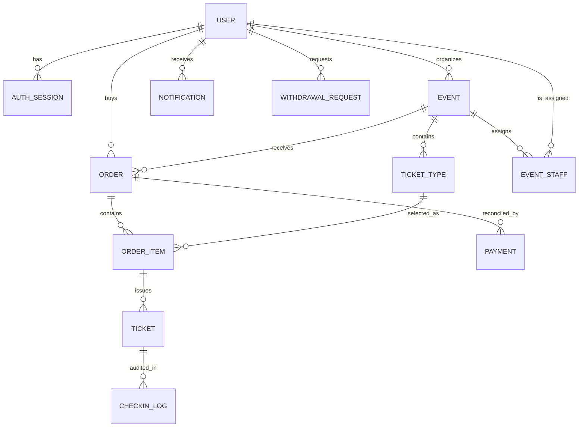
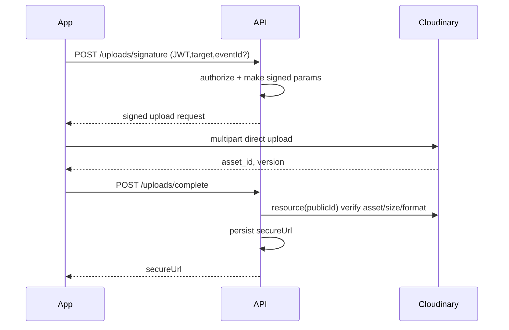
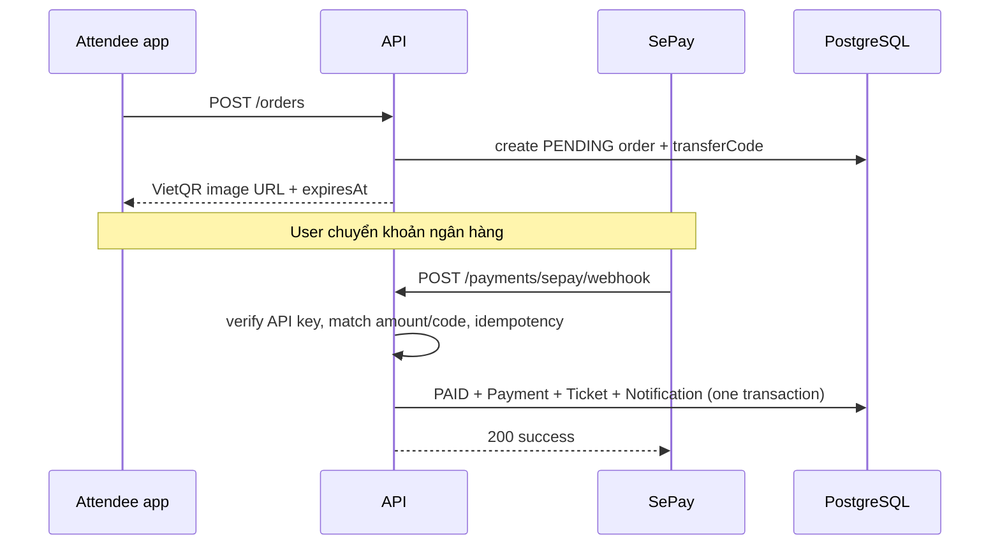

# Kiến trúc hệ thống eTicket

## 1. Tóm tắt kiến trúc

eTicket là client-server application gồm một app Expo đa nền tảng và một backend NestJS. Backend quản lý nghiệp vụ, PostgreSQL là nguồn dữ liệu chính, Cloudinary lưu ảnh, SePay gọi webhook xác nhận chuyển khoản, SMTP gửi email vé, Socket.IO cập nhật check-in realtime.



Không phải mọi mũi tên là đồng bộ:

- Tạo đơn/duyệt event/check-in là request-response đồng bộ từ app đến API.
- SePay callback là bất đồng bộ từ bên thứ ba.
- Email được queue sau commit, không chặn response.
- Notification tab và unread badge dùng REST polling mỗi 3 giây khi app active; đây là near real-time, không phải push OS.
- Socket.IO chỉ thông báo realtime; database vẫn là source of truth.

## 2. Cấu trúc repository

```text
event-ticketing/
├── app/                       # Expo React Native frontend
│   ├── src/app/               # Expo Router screens/routes
│   ├── src/components/        # UI component theo feature
│   ├── src/lib/api/           # API wrappers typed
│   ├── src/stores/            # Zustand state + persistence
│   ├── src/i18n/              # VI/EN translations
│   └── src/design/            # semantic theme tokens
├── backend/                   # NestJS API
│   ├── src/modules/           # domain modules
│   ├── src/common/            # errors, filter, request logging
│   ├── src/config/            # typed runtime config/Joi validation
│   ├── src/prisma/            # Prisma service
│   ├── prisma/schema.prisma   # data model
│   ├── prisma/seed.ts         # sample accounts/events/revenue
│   └── test/                  # unit and e2e tests
├── docs/DESIGN.md             # product/design guidelines
└── .nvmrc                     # Node 24
```

## 3. Frontend architecture

### 3.1 Routing và role areas

Expo Router map file-system thành route.

| Area | Route root | Layout guard | Screens tiêu biểu |
| --- | --- | --- | --- |
| Attendee | `/` | `app/src/app/(attendee)/_layout.tsx` | Explore, Vé của tôi, notification, profile |
| Organizer | `/organizer` | `app/src/app/organizer/_layout.tsx` | Overview, events, event form/detail, staff, withdrawals |
| Scanner | `/scanner` | `app/src/app/scanner/_layout.tsx` | Event picker, QR scan |
| Admin | `/admin` | `app/src/app/admin/_layout.tsx` | Operations dashboard, accounts, event moderation, payment review, withdrawals |
| Public/shared | `/auth`, `/event/[id]`, `/order/[id]`, `/account`, `/support` | root Stack | Login/register, detail, checkout, profile/security/legal |

Role layouts redirect nếu không có token hoặc sai role. Đây là điều hướng UI. Bảo mật vẫn được thực thi lại ở API bằng `JwtAuthGuard`, `RolesGuard`, `EventStaffGuard`.

### 3.2 Root providers

`app/src/app/_layout.tsx` khởi tạo thứ tự quan trọng:

1. Import global CSS, i18n, NativeWind interop.
2. Load Be Vietnam Pro, Space Grotesk, JetBrains Mono.
3. Hydrate auth, language, theme từ secure/local storage.
4. Đặt `QueryClientProvider` cho TanStack Query.
5. Đặt `SafeAreaProvider` cho notch/status bar.
6. Đặt navigation theme và NativeWind theme variables.
7. Chỉ hiển thị router sau launch splash/font/store readiness.

Lý do: nếu render screen trước hydrate, user có thể thấy flash sai ngôn ngữ/theme hoặc route auth sai.

### 3.3 Chia loại state



| State | Công cụ | Ví dụ |
| --- | --- | --- |
| Cục bộ, ngắn hạn | `useState`, `useRef` | ô search, form, modal, lock camera |
| Client global | Zustand | token/user, language preference, theme preference |
| Server/cache | TanStack Query | danh sách events, orders, notifications, statistics; polling notification 3 giây |
| Lưu lại sau mở app | SecureStore/AsyncStorage | JWT native, user cached, language/theme/city |

Điểm dễ bị hỏi: không đưa toàn bộ API result vào Zustand vì TanStack Query đã giải quyết stale cache, loading, refetch, invalidation tốt hơn cho server state.

### 3.4 API client và API contract

`app/src/lib/api/client.ts` là lớp fetch dùng chung:

- lấy JWT bằng `tokenStorage`;
- gắn `Authorization: Bearer ...`;
- nếu API URL thuộc `.ngrok-free.app`, gắn `ngrok-skip-browser-warning: true` để bỏ trang cảnh báo tunnel khi phát triển;
- JSON encode/decode;
- chuyển lỗi backend đồng nhất thành `ApiError(status, code, message, fields)`.

Header ngrok chỉ hỗ trợ môi trường tunnel, không thay thế JWT, CORS hoặc authorization của backend.

Wrapper theo domain nằm trong `app/src/lib/api/`: `orders.ts`, `events-organizer.ts`, `admin.ts`, `withdrawals.ts`… Các type lấy từ `schema.ts`, được sinh từ OpenAPI bằng script `npm run gen:api` chứ không viết lại tay.

### 3.5 Design system và i18n

- `app/src/design/tokens.ts`: palette semantic duy nhất.
- `app/src/design/themes.ts`: chuyển token thành NativeWind CSS variables.
- `app/src/i18n/locales/vi.ts`, `en.ts`: copy hiển thị.
- Component render string bằng `useTranslation()`, không hardcode copy mới.

Kiến trúc này tách *nghĩa* (`primary`, `surface`, `notifications.title`) khỏi màu/câu chữ cụ thể.

## 4. Backend architecture

### 4.1 Bootstrap và cross-cutting concerns

`backend/src/main.ts` làm các việc áp dụng cho toàn bộ API:



Chi tiết:

- Global prefix `/api`.
- CORS theo `FRONTEND_URL` (mặc định `*`).
- Global DTO validation.
- Swagger `/docs`, document `/docs-json`.
- `AllExceptionsFilter` chuẩn hóa response lỗi.
- Pino redact header authorization/cookie/API key.

`AppModule` đăng ký `JwtAuthGuard` bằng `APP_GUARD`, nên mọi API mặc định cần token. Chỉ route có `@Public()` như event discovery và webhook SePay mới đi qua.

### 4.2 Các module domain

| Module | Trách nhiệm | File chính |
| --- | --- | --- |
| Auth | register/login/session/password/scanner connect | `modules/auth` |
| Events | public discovery và organizer event/ticket type lifecycle | `modules/events` |
| Orders | tạo, giữ chỗ, hủy, đọc đơn | `modules/orders` |
| Payments | SePay webhook và review tiền lệch | `modules/payments` |
| Tickets | cấp vé, sign/verify QR, list my tickets | `modules/tickets` |
| Checkin | quét/consume ticket, audit log | `modules/checkin` |
| Realtime | Socket.IO room check-in | `modules/realtime` |
| Staff | scanner device và one-time connect code | `modules/staff` |
| Admin | duyệt organizer/event, feature, hide/unhide | `modules/admin` |
| Notifications | persisted in-app notification | `modules/notifications` |
| Uploads | Cloudinary signed image upload | `modules/uploads` |
| Statistics | dashboard và CSV revenue | `modules/statistics` |
| Withdrawals | organizer request/admin manual payout | `modules/withdrawals` |
| Mail | SMTP email ticket | `modules/mail` |

Module dependency phản ánh nghiệp vụ. Ví dụ Payments import Tickets/Notifications/Mail vì callback thành công cần cả ba; module Event không tự import Payments vì event creation không nên phụ thuộc payment.

### 4.3 Layer controller-service-repository

Dự án không tạo repository class riêng cho từng domain; `PrismaService` là data-access layer dùng chung. Luồng chuẩn:

```text
Controller (HTTP/DTO/user) -> Service (business rules) -> PrismaService (PostgreSQL)
```

Ví dụ `AdminController.approveEvent()` chỉ forward `adminId`, `eventId`; `AdminService.approveEvent()` kiểm tra trạng thái, CAS update, create notification trong transaction.

Đây là lựa chọn hợp lý ở quy mô hiện tại. Nếu project lớn hơn, có thể tách repository để cô lập query, nhưng không cần abstractions rỗng ngay từ đầu.

## 5. Database architecture

### 5.1 ER model rút gọn



Đọc chi tiết field/enum ở `backend/prisma/schema.prisma`.

### 5.2 Source of truth

| Dữ liệu | Nguồn sự thật |
| --- | --- |
| User, event, order, ticket, payment, notification | PostgreSQL |
| File ảnh | Cloudinary; DB chỉ lưu `secureUrl` |
| JWT | client mang token, nhưng `AuthSession` database quyết định còn hợp lệ |
| Check-in dashboard live | DB là đúng; Socket.IO chỉ đồng bộ UI |
| Ngôn ngữ hiển thị | preference trên thiết bị; locale DB là bản sao cho email/CSV fallback |

## 6. External integration architecture

### 6.1 Cloudinary



Secret Cloudinary không đi xuống app. `api_key` và signature là thành phần phục vụ signed upload; server vẫn xác minh lại kết quả upload trước lưu URL.

### 6.2 SePay



### 6.3 SMTP

Sau khi transaction cấp vé commit, `TicketEmailService` tự đọc lại order, render QR PNG qua `qrcode`, gửi email bằng Nodemailer. Email thất bại chỉ log; không rollback ticket.

## 7. Bảo mật theo lớp

```text
UI role redirect
       ↓
Bearer JWT signature + expiry
       ↓
AuthSession unrevoked + user not BLOCKED
       ↓
RolesGuard (role + ACTIVE)
       ↓
Ownership/EventStaff database check
       ↓
Business state validation + transaction/CAS
       ↓
Database unique/FK/index constraints
```

Ý nghĩa: nếu ai đó gọi API trực tiếp, ẩn nút frontend không đủ; lớp dưới vẫn từ chối.

## 8. Cấu hình và dependency thật sự dùng

### 8.1 Build/runtime configuration

| File | Điều cần biết khi trình bày |
| --- | --- |
| `.nvmrc` | Repository yêu cầu Node `24`. |
| `app/app.json` | Expo app `Event Ticketing`; iOS bundle/Android package `dev.vku.eventticketing`; portrait; static web; khai báo SecureStore, localization, date picker, ImagePicker và MediaLibrary permission. |
| `app/babel.config.js` | `babel-preset-expo` với `nativewind/babel`, để JSX NativeWind hoạt động. |
| `app/tailwind.config.js` | Màu không hardcode: Tailwind color role trỏ CSS variable do design token cấp; định nghĩa typography, spacing, touch target, radius, content width. |
| `app/tsconfig.json` | strict TypeScript, alias `@/* -> src/*`. |
| `backend/tsconfig.json` | TypeScript target ES2023, decorators/metadata cho NestJS, build ra `dist`. |
| `backend/src/config/env.validation.ts` | Joi fail fast nếu thiếu/invalid `DATABASE_URL`, JWT/HMAC secret; các integration config có default an toàn. |
| `backend/src/config/configuration.ts` | Đọc config typed: JWT, order hold 15 phút, withdrawal minimum 100.000 VND, SePay, Cloudinary, SMTP. |

App lấy API root từ `EXPO_PUBLIC_API_URL` trong `app/src/lib/config.ts`; REST client tự thêm `/api`, Socket.IO kết nối root URL. Backend environment không được đưa vào source: secret JWT, HMAC, Cloudinary API secret, SePay webhook key, SMTP password phải ở `.env`/deployment secret.

### Backend

| Công nghệ | Vai trò |
| --- | --- |
| NestJS 11 | HTTP module/controller/service/DI |
| Prisma 7 + `@prisma/adapter-pg` + `pg` | ORM/database adapter PostgreSQL |
| Passport JWT + `@nestjs/jwt` | bearer auth |
| bcryptjs | hash password |
| class-validator/transformer | DTO validation/transform |
| `@nestjs/schedule` | cron order expiry |
| Socket.IO | realtime check-in |
| Cloudinary | image storage |
| Nodemailer | SMTP ticket email |
| qrcode | QR PNG email |
| Joi | validate environment |
| nestjs-pino | structured HTTP logging |

### App

| Công nghệ | Vai trò |
| --- | --- |
| Expo 54, React Native 0.81, React 19 | app đa nền tảng |
| Expo Router | file-based routing |
| TanStack Query | server cache/mutation |
| Zustand | global client state |
| NativeWind | semantic token classes |
| i18next | VI/EN |
| SecureStore/AsyncStorage | persistence |
| Expo Camera | quét QR scanner/connect code |
| `react-native-qrcode-svg` | render QR trên màn hình |
| ViewShot + MediaLibrary | chụp và lưu ảnh vé |
| Image Picker | chọn ảnh |
| FileSystem + Sharing | lưu/chia sẻ CSV trên native |

## 9. Các quyết định kiến trúc nên giải thích khi bị hỏi

1. **Tại sao direct upload Cloudinary?** Giảm tải API cho file; secret vẫn ở server qua signature/verify.
2. **Tại sao JWT còn AuthSession?** Logout và đổi password revoke token ngay được.
3. **Tại sao QR ký HMAC nhưng vẫn query DB?** HMAC chống giả payload; DB bảo vệ trạng thái used.
4. **Tại sao notification lưu DB?** Có unread badge và xem lại sau khi login; push chỉ là lớp delivery thêm sau này.
5. **Tại sao email không nằm trong transaction?** External SMTP không thể rollback cùng PostgreSQL; không để mail failure làm mất vé.
6. **Tại sao dùng raw SQL `FOR UPDATE` bên cạnh Prisma?** Cần row lock chính xác để xử lý request đồng thời/oversell.
7. **Tại sao chuyển khoản không cấp vé từ client?** Webhook payment provider là nguồn xác nhận tin cậy.
