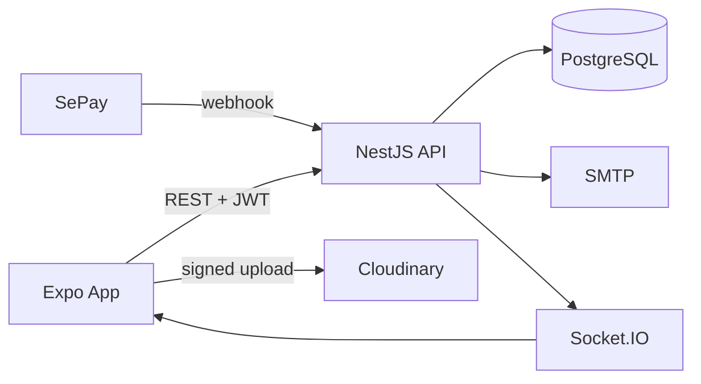
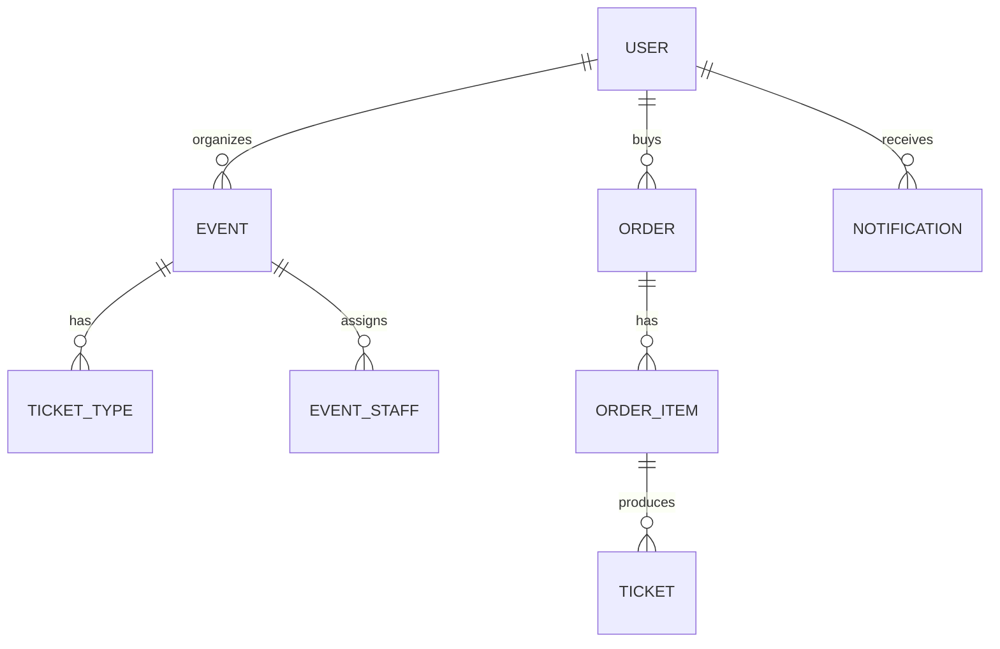
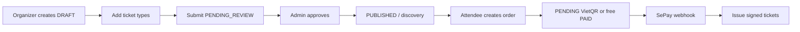
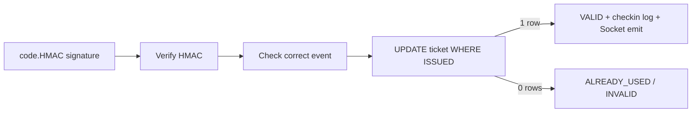

# Outline thuyết trình project eTicket

> Đây là kịch bản nói tự nhiên, không phải văn đọc y nguyên. Thời lượng phù hợp khoảng 10–15 phút; nếu chỉ có 7 phút, giữ các phần 1, 2, 3, 5, 6, 8, 9.

## 0. Chuẩn bị demo trước khi nói

1. Chuẩn bị một admin, organizer active, attendee và scanner seed/demo account.
2. Chuẩn bị ít nhất một event đã published, một event chờ review và một đơn pending/paid nếu muốn demo đầy đủ.
3. Đảm bảo backend có environment đúng: PostgreSQL, JWT/HMAC secrets; SePay/Cloudinary/SMTP chỉ demo nếu đang cấu hình.
4. Demo theo một câu chuyện liên tục: organizer tạo -> admin duyệt -> attendee mua -> scanner check-in.

Không cần cố demo mọi tab. Một flow xuyên role thuyết phục hơn mở từng màn rời rạc.

## 1. Mở đầu – 30 giây

### Slide/nội dung

**eTicket – Nền tảng quản lý và bán vé sự kiện đa vai trò**

### Cách nói

> Em xin trình bày eTicket, một hệ thống hỗ trợ quản lý toàn bộ vòng đời vé sự kiện. Hệ thống không chỉ bán vé cho người tham dự mà còn có organizer tạo sự kiện, admin kiểm duyệt và scanner check-in tại cổng. Điểm em tập trung là làm cho trạng thái vé, thanh toán và số lượng tồn kho nhất quán ngay cả khi có nhiều request cùng lúc.

## 2. Bài toán và đối tượng sử dụng – 1 phút

### Slide/nội dung

| Role | Mục tiêu |
| --- | --- |
| Attendee | Tìm event, đặt vé, thanh toán, lưu/xem QR |
| Organizer | Tạo event/hạng vé, quản lý scanner, doanh thu/rút tiền |
| Scanner | Quét QR đúng event, phát hiện vé đã dùng |
| Admin | Duyệt organizer/event, featured/moderation, xử lý queue tiền/rút tiền |

### Cách nói

> Bài toán thực tế có nhiều vai trò với quyền khác nhau. Nếu chỉ làm app bán vé thì organizer có thể tự public mọi event và scanner có thể quét bất kỳ event nào. Vì vậy em thiết kế quy trình approval và phân quyền ở backend, không chỉ ẩn nút ở giao diện.

> Organizer đăng ký sẽ ở trạng thái chờ duyệt. Event organizer tạo bắt đầu là draft; chỉ sau khi admin duyệt thì mới xuất hiện ở trang khám phá của attendee. Scanner là thiết bị do organizer tạo và chỉ được check-in event được gán.

## 3. Công nghệ và lý do chọn – 1 phút

### Slide/nội dung

```text
App: Expo + React Native + Expo Router
State: TanStack Query + Zustand
Backend: NestJS + TypeScript
Database: PostgreSQL + Prisma
Integration: SePay, Cloudinary, Socket.IO, SMTP
Security: bcrypt, JWT + AuthSession, HMAC QR
```

### Cách nói

> Frontend em dùng Expo React Native để chạy mobile và web từ một codebase. TanStack Query quản lý dữ liệu từ API như event, order, notification; Zustand giữ state nhỏ phía client như user đăng nhập, ngôn ngữ và theme. Riêng notification của Attendee, Organizer và Admin được poll mỗi 3 giây khi app active để cập nhật danh sách và badge gần thời gian thực.

> Backend là NestJS vì có cấu trúc module, controller, service và dependency injection rõ ràng. PostgreSQL dùng cho dữ liệu quan hệ, còn Prisma giúp schema và query type-safe. Với nghiệp vụ vé, em dùng transaction, row lock và guarded update để chống race condition.

## 4. Kiến trúc tổng thể – 1 đến 1.5 phút

### Slide/nội dung



### Cách nói

> App giao tiếp với backend qua REST API và bearer JWT. Backend là nơi duy nhất kiểm tra quyền, giá, số lượng vé và trạng thái đơn. PostgreSQL là nguồn dữ liệu chính.

> Ảnh không upload qua backend mà app xin chữ ký từ backend rồi upload trực tiếp Cloudinary. Sau đó backend verify lại asset trước khi lưu URL. Thanh toán là callback webhook từ SePay, không tin việc user bấm đã thanh toán. Socket.IO chỉ dùng để dashboard check-in cập nhật realtime; trạng thái vé vẫn nằm trong database.

> Notification không đi qua Socket.IO. App chủ động gọi lại REST API mỗi 3 giây và dừng khi chạy nền, nên đây là near real-time polling chứ chưa phải push notification trên thiết bị.

### Câu có thể bị hỏi ngay

> “Tại sao không để app tự tính giá và số vé còn lại?”

Trả lời: Vì app có thể bị chỉnh sửa hoặc dữ liệu stale. Backend đọc giá và reservation hiện tại trong transaction, nên mới là nguồn quyết định.

## 5. Thiết kế dữ liệu – 1 phút

### Slide/nội dung



### Cách nói

> Phần dữ liệu xoay quanh User, Event, TicketType, Order, OrderItem và Ticket. Một order có nhiều order item; mỗi order item có thể cấp nhiều ticket. Em lưu `unitPriceVnd` ở OrderItem để snapshot giá lúc mua, nên sau này organizer đổi giá ticket type thì lịch sử cũ không bị thay đổi.

> Tiền dùng BigInt ở database để không có sai số số thực. Em đặt unique constraint cho email, transfer code, QR code, payment transaction id và idempotency key của order.

## 6. Flow chính: từ tạo event đến bán vé – 2 phút

### Slide/nội dung



### Cách nói

> Organizer chỉ tạo draft và thêm ít nhất một hạng vé. Nút publish ở organizer thực chất là gửi sự kiện sang trạng thái chờ admin review. Admin duyệt thì event chuyển published và organizer nhận thông báo.

> Attendee chọn hạng vé và tạo order. Backend không nhận giá từ client mà tự đọc giá ticket type. Nếu order có tổng bằng 0 thì hệ thống paid và cấp vé ngay. Nếu có tiền thì order pending, backend trả VietQR cùng mã nội dung chuyển khoản và thời hạn.

> Chỉ khi SePay gọi webhook hợp lệ, mã chuyển khoản và amount khớp, order chưa quá hạn, hệ thống mới paid order và cấp QR ticket.

## 7. Điểm kỹ thuật nổi bật: chống oversell và idempotency – 1.5 phút

### Slide/nội dung

```text
available = quantityTotal - SUM(PENDING + PAID reservations)

Transaction:
  lock buyer        -> max 3 pending orders
  lock ticket types -> correct availability
  calculate price from DB
  create order/items atomically
```

### Cách nói

> Đây là phần quan trọng nhất của nghiệp vụ bán vé. Nếu hai người cùng mua chiếc vé cuối, chỉ đọc số lượng rồi insert sẽ bị oversell. Trong transaction, em lock các ticket type bằng `FOR UPDATE`, sau đó tính số reservation từ các order pending và paid. Request sau phải chờ request trước, rồi tính lại số còn.

> Em cũng sắp thứ tự lock theo id để giảm deadlock khi một đơn mua nhiều hạng vé. Với retry mạng, order có `clientRequestId` unique theo buyer; webhook có `sepayTxnId` unique, do đó request lặp không cấp thêm vé.

### Có thể chiếu code

`backend/src/modules/orders/orders.service.ts` – phần `SELECT ... FOR UPDATE`, aggregate reservation và `clientRequestId`.

## 8. QR check-in và realtime – 1 đến 1.5 phút

### Slide/nội dung



### Cách nói

> Mỗi vé có random code và HMAC signature từ secret chỉ server biết. Scanner verify signature trước để loại QR giả. Sau đó backend kiểm tra vé có thuộc event đang quét không.

> Để chống quét hai lần, em không làm kiểu “đọc status rồi update”. Em dùng một câu update có điều kiện status vẫn là ISSUED. Hai scanner quét cùng lúc thì chỉ một update ảnh hưởng một dòng và nhận VALID; máy còn lại nhận ALREADY_USED. Mọi kết quả đều được ghi CheckinLog để audit. Với scan hợp lệ, server emit Socket.IO để organizer dashboard cập nhật count realtime.

## 9. Các chức năng quản trị và doanh thu – 1 phút

### Slide/nội dung

- Admin: approve/block organizer; approve/feature/hide/unhide event.
- Payment review: tiền không match/đến muộn vào queue, không tự cấp vé.
- Statistics: revenue PAID, tickets sold, daily 30 days, top events, CSV summary/detail.
- Withdrawal: chỉ revenue event đã kết thúc; admin xử lý payout thủ công.

### Cách nói

> Admin có dashboard vận hành để thấy các queue cần xử lý. Khi hide event, hệ thống đồng thời cancel các pending order để giải phóng chỗ; paid ticket không tự hủy vì refund là nghiệp vụ khác.

> Báo cáo chỉ aggregate order paid. CSV có range theo giờ Việt Nam và escape công thức spreadsheet để tên event do organizer nhập không thành formula khi mở Excel. Organizer rút được doanh thu của event đã kết thúc, và admin ghi nhận chuyển khoản thủ công để hệ thống có lịch sử audit.

## 10. Demo gợi ý – 2 đến 3 phút

### Kịch bản A: approval và notification

1. Login organizer active.
2. Mở event draft, cho xem hạng vé/ảnh cover, bấm gửi duyệt.
3. Chuyển admin: thấy event pending, approve.
4. Quay organizer và chờ tối đa khoảng một chu kỳ polling: tab notification có event đã được duyệt và badge cập nhật.
5. Quay attendee: event xuất hiện trong khám phá nếu thời gian event còn ở tương lai.

### Kịch bản B: vé và check-in

1. Attendee mở event published, chọn hạng vé.
2. Nếu có paid sample, mở Vé của tôi và QR; cho xem nút lưu ảnh.
3. Login scanner bằng connect code hoặc account device.
4. Chọn assigned event, quét QR lần 1: VALID.
5. Quét lại cùng QR: ALREADY_USED.
6. Nếu organizer event detail đang mở, chỉ dashboard update realtime.

### Kịch bản C: pending order

1. Tạo order paid, show VietQR/countdown/pending carousel.
2. Hủy pending order bằng confirmation dialog.
3. Giải thích status CANCELLED release inventory ngay; cron xử lý EXPIRED khi không hủy.

## 11. Testing và chất lượng – 30 giây

### Cách nói

> Backend có unit test cho QR signer, event lifecycle, mail, withdrawal, và e2e test cho auth, orders, payment webhook, check-in, staff, notifications, admin moderation, withdrawal. Ngoài test code, các phần phụ thuộc thiết bị như camera, Media Library và mạng tunnel cần test thực tế trên máy/điện thoại.

> Khi thay đổi backend contract, em dùng Swagger/OpenAPI; app tạo type schema từ `/docs-json` để giảm lệch type giữa hai phía.

## 12. Hạn chế và hướng phát triển – 1 phút

### Slide/nội dung

| Hạn chế hiện tại | Hướng phát triển |
| --- | --- |
| In-app notification, chưa push OS | Expo push token + outbox worker |
| SePay transfer, review/payout thủ công | thêm cổng payment/payout và ledger/refund |
| sales window chưa enforce checkout | validate trong `OrdersService` + e2e boundary tests |
| Email best effort | outbox/retry/dead-letter |
| Socket không check revoked session parity HTTP | tái dùng session validation |

### Cách nói

> Bản hiện tại ưu tiên tính đúng đắn của core ticket flow. Một số phần em chủ động ghi rõ giới hạn: notification mới dùng polling 3 giây và chưa có push OS; chưa có refund, payout tự động; email là best effort; sales window đã lưu nhưng chưa chặn checkout. Source cũng chưa có Outbox model/worker. Hướng tiếp theo là bổ sung outbox cho side effect, tích hợp payment/payout provider, bổ sung ledger và test tải cho inventory/check-in.

## 13. Kết thúc – 15 giây

### Cách nói

> Tóm lại, eTicket giải quyết luồng vận hành vé từ tạo event, kiểm duyệt, thanh toán đến check-in. Những điểm kỹ thuật em chú trọng là phân quyền theo role và ownership, transaction chống oversell, idempotent webhook, QR ký HMAC và atomic check-in. Em xin cảm ơn và sẵn sàng trả lời câu hỏi.

## 14. Nếu bị giảng viên hỏi sâu, chuyển đến đâu?

| Câu hỏi | Mở file |
| --- | --- |
| Login/JWT/logout | `backend/src/modules/auth/auth.service.ts`, `jwt.strategy.ts` |
| Duyệt event/lifecycle | `backend/src/modules/events/events-organizer.service.ts`, `modules/admin/admin.service.ts` |
| Oversell/order payment | `backend/src/modules/orders/orders.service.ts`, `modules/payments/payments.service.ts` |
| QR/check-in | `modules/tickets/ticket-signer.service.ts`, `modules/checkin/checkin.service.ts` |
| Schema/relation | `backend/prisma/schema.prisma` |
| Frontend cache/state | `app/src/lib/api/client.ts`, `app/src/stores/auth-store.ts`, `app/src/lib/query/query-client.ts` |
| Upload image | `modules/uploads/uploads.service.ts`, `app/src/lib/api/uploads.ts` |
| Report/withdrawal | `modules/statistics/statistics.service.ts`, `modules/withdrawals/withdrawals.service.ts` |
