# Giải thích chi tiết các service của backend eTicket

Tài liệu này giải thích các class service hiện có trong `backend/src`, bám theo source hiện tại. Mục tiêu là giúp đọc code và trả lời vấn đáp: service chịu trách nhiệm gì, nhận dữ liệu từ đâu, gọi thành phần nào, bảo vệ quy tắc nghiệp vụ nào và vì sao cách triển khai đó cần thiết.

## 1. Service trong NestJS là gì?

Trong project, một request thường đi theo luồng:

```text
App
  -> Controller
  -> Guard
  -> Service
  -> PrismaService
  -> PostgreSQL
  -> DTO response
  -> App
```

- **Controller** nhận HTTP request, đọc param/body/current user và gọi service.
- **Guard** kiểm tra đăng nhập, role hoặc quyền trên sự kiện.
- **Service** xử lý business logic và phối hợp database/dịch vụ ngoài.
- **PrismaService** là cổng truy cập PostgreSQL.
- **DTO** là contract dữ liệu request/response của API.

Service được đánh dấu `@Injectable()` để NestJS có thể tạo instance và tiêm dependency qua constructor:

```ts
@Injectable()
export class OrdersService {
  constructor(
    private readonly prisma: PrismaService,
    private readonly tickets: TicketsService,
  ) {}
}
```

`OrdersService` không tự `new PrismaService()`. NestJS Dependency Injection container cung cấp các dependency đã đăng ký trong module. Cách này giảm coupling và giúp thay dependency bằng mock khi test.

## 2. Bản đồ service

| Service | File | Trách nhiệm chính |
| --- | --- | --- |
| `AppService` | `backend/src/app.service.ts` | Endpoint mẫu/health rất cơ bản |
| `PrismaService` | `backend/src/prisma/prisma.service.ts` | Kết nối và truy cập PostgreSQL |
| `AuthService` | `backend/src/modules/auth/auth.service.ts` | Đăng ký, đăng nhập, session, mật khẩu, scanner connect |
| `EventsService` | `backend/src/modules/events/events.service.ts` | Danh sách và chi tiết sự kiện công khai |
| `EventsOrganizerService` | `backend/src/modules/events/events-organizer.service.ts` | Organizer tạo, sửa, gửi duyệt sự kiện và quản lý hạng vé |
| `AdminService` | `backend/src/modules/admin/admin.service.ts` | Quản trị Organizer và kiểm duyệt sự kiện |
| `StaffService` | `backend/src/modules/staff/staff.service.ts` | Quản lý tài khoản thiết bị Scanner và mã kết nối |
| `OrdersService` | `backend/src/modules/orders/orders.service.ts` | Đặt vé, giữ chỗ, VietQR, xem/hủy đơn |
| `OrdersExpiryService` | `backend/src/modules/orders/orders-expiry.service.ts` | Tự động hết hạn đơn chờ thanh toán |
| `PaymentsService` | `backend/src/modules/payments/payments.service.ts` | Xử lý webhook SePay và cấp vé sau thanh toán |
| `PaymentReviewsService` | `backend/src/modules/payments/payment-reviews.service.ts` | Admin xử lý các giao dịch cần đối soát thủ công |
| `TicketSignerService` | `backend/src/modules/tickets/ticket-signer.service.ts` | Sinh code và ký/xác minh QR bằng HMAC |
| `TicketsService` | `backend/src/modules/tickets/tickets.service.ts` | Phát hành và liệt kê vé điện tử |
| `CheckinService` | `backend/src/modules/checkin/checkin.service.ts` | Xác minh và tiêu thụ vé khi check-in |
| `NotificationsService` | `backend/src/modules/notifications/notifications.service.ts` | Lưu, đọc và đánh dấu thông báo |
| `UploadsService` | `backend/src/modules/uploads/uploads.service.ts` | Signed direct upload với Cloudinary |
| `StatisticsService` | `backend/src/modules/statistics/statistics.service.ts` | Thống kê doanh thu/vé và xuất CSV |
| `WithdrawalsService` | `backend/src/modules/withdrawals/withdrawals.service.ts` | Số dư và vòng đời yêu cầu rút tiền |
| `MailService` | `backend/src/modules/mail/mail.service.ts` | Gửi email qua SMTP theo kiểu best effort |
| `TicketEmailService` | `backend/src/modules/mail/ticket-email.service.ts` | Tạo và gửi email vé sau khi cấp vé |
| `CheckinGateway` | `backend/src/modules/realtime/checkin.gateway.ts` | Socket.IO realtime cho dashboard check-in |

## 3. Sơ đồ dependency chính

```mermaid
flowchart TD
  Controllers[Controllers]
  Prisma[PrismaService]
  Auth[AuthService]
  PublicEvents[EventsService]
  OrgEvents[EventsOrganizerService]
  Admin[AdminService]
  Staff[StaffService]
  Orders[OrdersService]
  Expiry[OrdersExpiryService]
  Payments[PaymentsService]
  Reviews[PaymentReviewsService]
  Tickets[TicketsService]
  Signer[TicketSignerService]
  Checkin[CheckinService]
  Notify[NotificationsService]
  Uploads[UploadsService]
  Stats[StatisticsService]
  Withdrawals[WithdrawalsService]
  TicketEmail[TicketEmailService]
  Mail[MailService]
  Gateway[CheckinGateway]

  Controllers --> Auth
  Controllers --> PublicEvents
  Controllers --> OrgEvents
  Controllers --> Admin
  Controllers --> Staff
  Controllers --> Orders
  Controllers --> Payments
  Controllers --> Reviews
  Controllers --> Checkin
  Controllers --> Notify
  Controllers --> Uploads
  Controllers --> Stats
  Controllers --> Withdrawals

  Auth --> Prisma
  PublicEvents --> Prisma
  OrgEvents --> Prisma
  Admin --> Prisma
  Staff --> Prisma
  Orders --> Prisma
  Expiry --> Prisma
  Payments --> Prisma
  Reviews --> Prisma
  Tickets --> Prisma
  Checkin --> Prisma
  Notify --> Prisma
  Uploads --> Prisma
  Stats --> Prisma
  Withdrawals --> Prisma
  TicketEmail --> Prisma
  Gateway --> Prisma

  Orders --> Tickets
  Orders --> Notify
  Orders --> TicketEmail
  Payments --> Tickets
  Payments --> Notify
  Payments --> TicketEmail
  Tickets --> Signer
  Checkin --> Signer
  Checkin --> Gateway
  TicketEmail --> Signer
  TicketEmail --> Mail
```



## 4. `PrismaService`: lớp truy cập database dùng chung

**File:** `backend/src/prisma/prisma.service.ts`

`PrismaService` kế thừa generated `PrismaClient`, nên các service có thể gọi:

```ts
this.prisma.user.findUnique(...)
this.prisma.order.create(...)
this.prisma.$transaction(...)
```

### Dependency

- `ConfigService`: lấy `database.url`.
- `PrismaPg`: driver adapter PostgreSQL bắt buộc theo cấu hình Prisma 7 của project.
- `PinoLogger`: ghi log kết nối.

### Vòng đời

| Method | Ý nghĩa |
| --- | --- |
| `onModuleInit()` | `$connect()`, chạy `SELECT 1`, chỉ log thành công sau một round trip thật |
| `onModuleDestroy()` | `$disconnect()` khi NestJS đóng ứng dụng |

`$connect()` thành công chưa chắc query được database. Vì vậy `SELECT 1` kiểm tra kết nối thực tế trước khi log `Database connected`.

## 5. `AuthService`: danh tính, mật khẩu và session

**File:** `backend/src/modules/auth/auth.service.ts`

**Controller gọi:** `backend/src/modules/auth/auth.controller.ts`

### Dependency

- `PrismaService`: đọc/ghi `User`, `AuthSession`, `StaffConnectCode`.
- `JwtService`: ký access token.
- `ConfigService`: JWT secret và thời hạn token.
- `bcryptjs`: hash và so sánh mật khẩu.

### Public methods

| Method | Endpoint | Chức năng |
| --- | --- | --- |
| `register(dto)` | `POST /auth/register` | Tạo Attendee hoặc Organizer |
| `login(dto)` | `POST /auth/login` | Xác minh email/mật khẩu và tạo session |
| `staffConnect(code)` | `POST /auth/staff-connect` | Đổi mã một lần lấy session Scanner |
| `updateMe(userId, dto)` | `PATCH /auth/me` | Sửa tên, số điện thoại, locale |
| `changePassword(userId, sessionId, dto)` | `PATCH /auth/password` | Đổi mật khẩu và thu hồi session khác |
| `logout(userId, sessionId)` | `POST /auth/logout` | Thu hồi session hiện tại |

### `register()`

1. Chuẩn hóa email bằng `trim().toLowerCase()`.
2. Organizer mới có `status = PENDING`; Attendee có `ACTIVE`.
3. Hash mật khẩu với bcrypt cost 10.
4. Tạo `User`.
5. Chuyển Prisma `P2002` thành `EMAIL_ALREADY_REGISTERED`.
6. Gọi `buildSession()` để tạo JWT và `AuthSession`.

Organizer pending vẫn được xác thực và vào app, nhưng authorization guard chặn nghiệp vụ Organizer cho tới khi Admin kích hoạt.

### `login()` và `DUMMY_HASH`

Nếu không tìm thấy email, service vẫn chạy bcrypt compare với `DUMMY_HASH`. Điều này làm đường xử lý email tồn tại và không tồn tại gần giống nhau, giảm khả năng dò email qua thời gian phản hồi.

Sau khi mật khẩu đúng, tài khoản `BLOCKED` vẫn bị từ chối.

### `staffConnect()`

1. Chuẩn hóa code thành uppercase.
2. SHA-256 code để tìm `StaffConnectCode`.
3. Kiểm tra tồn tại, chưa hết hạn và Scanner không bị block.
4. `updateMany({ redeemedAt: null })` đánh dấu dùng một lần.
5. Chỉ request cập nhật được đúng một row mới nhận session.
6. Scanner dùng thời hạn token riêng, mặc định 30 ngày.

Mọi trường hợp mã sai, hết hạn, đã dùng hoặc staff bị block đều trả cùng `INVALID_CONNECT_CODE`; client không biết chính xác mã thất bại ở bước nào.

### `changePassword()`

- So sánh mật khẩu hiện tại.
- Không cho mật khẩu mới trùng mật khẩu cũ.
- Hash mật khẩu mới.
- Trong cùng transaction: cập nhật mật khẩu và revoke tất cả session khác.
- Session đang đổi mật khẩu được giữ lại nhờ `id: { not: sessionId }`.

### `buildSession()`

1. Sinh `sessionId` bằng UUID.
2. Ký JWT có `sub = userId`, `sid = sessionId`.
3. Đọc `exp` từ token.
4. Tạo `AuthSession` với đúng thời điểm hết hạn.
5. Trả `{ accessToken, user }`.

JWT chứng minh request có token hợp lệ; bản ghi `AuthSession` giúp logout/revoke có hiệu lực trước khi JWT tự hết hạn.

## 6. `EventsService`: sự kiện công khai cho Attendee

**File:** `backend/src/modules/events/events.service.ts`

**Controller gọi:** `backend/src/modules/events/events.controller.ts`

### `findAll(query)`

Chỉ trả sự kiện:

- `status = PUBLISHED`;
- `startAt >= hiện tại`;
- phù hợp category, featured, city và search nếu được truyền.

Search không phân biệt hoa thường trên `title` hoặc `city`. Kết quả sắp xếp theo `startAt` tăng dần. Giá thấp nhất được lấy bằng ticket type rẻ nhất:

```ts
ticketTypes: {
  orderBy: { priceVnd: 'asc' },
  take: 1,
}
```

### `findOne(id)`

Chỉ đọc chi tiết nếu sự kiện đang `PUBLISHED`. Số vé còn lại của từng hạng là:

```text
quantityRemaining = quantityTotal - tổng quantity của đơn PENDING và PAID
```

`PENDING` được tính vì đó là ghế đang giữ trong thời gian chờ chuyển khoản. `EXPIRED` và `CANCELLED` không giữ tồn kho.

## 7. `EventsOrganizerService`: vòng đời sự kiện và hạng vé

**File:** `backend/src/modules/events/events-organizer.service.ts`

**Controller gọi:** `backend/src/modules/events/events-organizer.controller.ts`

### Public methods

| Method | Chức năng |
| --- | --- |
| `list(organizerId)` | Liệt kê sự kiện thuộc Organizer |
| `get(organizerId, id)` | Xem chi tiết sự kiện sở hữu |
| `create(organizerId, dto)` | Tạo sự kiện `DRAFT` |
| `update(...)` | Sửa sự kiện `DRAFT` |
| `remove(...)` | Xóa sự kiện `DRAFT` |
| `publish(...)` | Gửi `DRAFT` sang `PENDING_REVIEW` |
| `unpublish(...)` | Đưa trạng thái hợp lệ về `DRAFT` và bỏ featured |
| `cancel(...)` | Chuyển `PUBLISHED` sang `CANCELLED` |
| `addTicketType(...)` | Thêm hạng vé khi event còn editable |
| `updateTicketType(...)` | Sửa hạng vé, không giảm dưới số đã giữ |
| `removeTicketType(...)` | Xóa hạng vé trong event `DRAFT` |

### State machine

```text
DRAFT -> PENDING_REVIEW
PENDING_REVIEW -> DRAFT hoặc PUBLISHED
PUBLISHED -> DRAFT hoặc CANCELLED
HIDDEN -> DRAFT
CANCELLED -> không chuyển tiếp
```

`assertTransition(from, to)` biểu diễn các cạnh hợp lệ. Tuy nhiên Organizer không trực tiếp duyệt `PENDING_REVIEW -> PUBLISHED`; thao tác đó nằm trong `AdminService.approveEvent()`.

### Quy tắc sửa dữ liệu

- `assertEventDates`: `startAt` phải trước `endAt`.
- `assertEventEditable`: chỉ `DRAFT` được sửa.
- `assertSalesWindow`: thời gian mở bán phải trước thời gian kết thúc bán.
- `assertTicketQuantityNotBelowReserved`: không giảm tổng vé xuống dưới lượng đang nằm trong đơn `PENDING` hoặc `PAID`.
- `loadOwnedEvent`: luôn lọc cả `id` và `organizerId`; không tìm thấy trả 404 để tránh dò event của Organizer khác.

### `publish()`

1. `SELECT ... FOR UPDATE` khóa row Event.
2. Đọc lại owner, title và status trong transaction.
3. Kiểm tra chuyển `DRAFT -> PENDING_REVIEW`.
4. Yêu cầu ít nhất một `TicketType`.
5. Conditional update đúng row đang `DRAFT`.
6. Tạo `EVENT_SUBMITTED` cho mọi Admin active.
7. Event và notification cùng commit hoặc cùng rollback.

### Sửa hạng vé và row lock

`lockEditableEvent()` khóa Event trước khi thêm/sửa/xóa hạng vé. `updateTicketType()` khóa tiếp TicketType rồi mới đếm lượng đã giữ. Thứ tự lock ổn định giúp tránh event được submit đồng thời trong lúc hạng vé đang sửa.

### Mapper

`ticketTypeSelect -> TicketTypeRow -> toTicketTypeDto()` là pattern chuyển Prisma payload thành response DTO. Mapper tính `soldCount`, đổi `BigInt` thành number và `Date` thành ISO string.

## 8. `AdminService`: tài khoản Organizer và kiểm duyệt Event

**File:** `backend/src/modules/admin/admin.service.ts`

**Controller gọi:** `backend/src/modules/admin/admin.controller.ts`

### Public methods

| Method | Chức năng |
| --- | --- |
| `listOrganizers(query)` | Search, lọc trạng thái và phân trang Organizer |
| `updateOrganizerStatus(...)` | Duyệt hoặc block Organizer |
| `listEvents(query)` | Search/lọc/phân trang tất cả sự kiện |
| `getEvent(eventId)` | Chi tiết kiểm duyệt, doanh thu và check-in |
| `updateEventFeatured(...)` | Bật/tắt nổi bật cho event đã public |
| `approveEvent(...)` | Duyệt `PENDING_REVIEW -> PUBLISHED` |
| `hideEvent(...)` | Ẩn event public và hủy đơn pending |
| `unhideEvent(...)` | Khôi phục `HIDDEN -> PUBLISHED` |

### Select, Row và DTO

Ba object `organizerSelect`, `adminEventSelect`, `adminEventDetailSelect` quy định Prisma phải lấy trường nào. `Prisma.*GetPayload` tạo kiểu row tương ứng. Các hàm `toAdminOrganizerDto`, `toAdminEventDto`, `toAdminEventDetailDto` chuyển row thành API contract, làm phẳng relation và tính `sold/capacity`.

### `approveEvent()`

1. Tìm Event.
2. `assertAdminApprovalTransition()` chỉ chấp nhận `PENDING_REVIEW`.
3. Conditional update status sang `PUBLISHED`.
4. Tạo notification `EVENT_APPROVED` cho Organizer.
5. Tất cả nằm trong transaction.

`assert` giúp thể hiện quy tắc rõ ràng; điều kiện status trong `updateMany` mới bảo vệ khi hai Admin thao tác đồng thời.

### `updateEventFeatured()`

- Chỉ event `PUBLISHED` được bật featured.
- Nếu giá trị không đổi thì trả row hiện tại.
- Conditional update kiểm tra cả status và giá trị featured cũ.
- Khi chuyển `false -> true`, tạo `EVENT_FEATURED` cho Organizer.
- Tắt featured không tạo thông báo mới.

### `hideEvent()`

Trong một transaction:

1. Chỉ cho `PUBLISHED -> HIDDEN`.
2. Đặt `featured = false` và lưu `hiddenReason`.
3. Chuyển mọi Order `PENDING` của event sang `CANCELLED` để giải phóng ghế.
4. Thông báo `EVENT_HIDDEN` cho Organizer.

Nếu tiền đến sau khi order bị cancel, `PaymentsService` không cấp vé mà đưa giao dịch vào review.

### `unhideEvent()`

Chỉ cho `HIDDEN -> PUBLISHED`, xóa `hiddenReason` và thông báo `EVENT_UNHIDDEN`. Event không tự trở lại featured; Admin phải chọn lại.

## 9. `StaffService`: tài khoản thiết bị Scanner

**File:** `backend/src/modules/staff/staff.service.ts`

**Controller gọi:** `backend/src/modules/staff/staff.controller.ts`

### Ba model liên quan

| Model/field | Ý nghĩa |
| --- | --- |
| `User(role=SCANNER, managedById=...)` | Tài khoản thiết bị và Organizer sở hữu |
| `EventStaff(eventId, userId)` | Scanner được phân công vào event nào |
| `StaffConnectCode` | Mã một lần để thiết bị nhận JWT |

### Public methods

| Method | Chức năng |
| --- | --- |
| `createDevice(...)` | Tạo Scanner, assignment và connect code |
| `listDevices(...)` | Danh sách thiết bị, lần scan cuối và tình trạng code |
| `reconnect(...)` | Xóa code chưa dùng và sinh code mới |
| `updateDevice(...)` | Đổi label hoặc `ACTIVE/BLOCKED` |
| `hashCode(code)` | SHA-256 connect code trước khi lưu |

### `createDevice()`

Sau khi xác minh Organizer sở hữu Event, transaction tạo:

1. `User` role `SCANNER`, không email/password, có `managedById`.
2. `EventStaff` gán Scanner vào Event.
3. `StaffConnectCode` chứa hash và hạn bảy ngày.

Plaintext code chỉ xuất hiện trong response, không lưu database. Alphabet loại `0/O/1/I` để giảm nhầm khi đọc hoặc chép mã.

`AuthService.staffConnect()` tự áp dụng lại cùng phép SHA-256 khi nhận plaintext code; nó không gọi trực tiếp `StaffService.hashCode()`.

### `listDevices()`

Sau khi lấy assignments, service chạy song song:

- `CheckinLog.groupBy` lấy `MAX(scannedAt)` theo staff;
- tìm connect code chưa dùng và chưa hết hạn.

`Map` và `Set` giúp ghép kết quả với từng thiết bị mà không phải query trong vòng lặp.

### `reconnect()` và `updateDevice()`

- Reconnect xóa mọi code chưa redeem rồi tạo code mới.
- Block Scanner đồng thời xóa code chưa redeem.
- Reconnect hiện không trực tiếp revoke session đã cấp trên thiết bị cũ.

## 10. `OrdersService`: đặt vé và giữ tồn kho

**File:** `backend/src/modules/orders/orders.service.ts`

**Controller gọi:** `backend/src/modules/orders/orders.controller.ts`

### Public methods

| Method | Chức năng |
| --- | --- |
| `create(buyerId, dto)` | Tạo order/order items, giữ vé hoặc cấp vé miễn phí |
| `listPending(buyerId)` | Danh sách đơn còn chờ và chưa hết hạn |
| `cancelPending(...)` | Attendee chủ động hủy đơn pending |
| `getById(...)` | Xem order của chính buyer |

### `create()` theo từng bước

1. Gộp các item trùng `ticketTypeId` bằng `Map`.
2. Khóa row `User` của buyer để serialize số đơn pending của cùng tài khoản.
3. Nếu có `clientRequestId`, tìm order cũ để chống tạo trùng khi retry.
4. Kiểm tra Event đang `PUBLISHED`.
5. Khóa các TicketType theo thứ tự ID bằng `FOR UPDATE`.
6. Kiểm tra mọi TicketType thuộc đúng Event.
7. Đếm tồn kho đã giữ bởi Order `PENDING` và `PAID`.
8. Nếu yêu cầu lớn hơn số còn lại, trả `SOLD_OUT`.
9. Tính `totalVnd` bằng `BigInt`.
10. Với đơn có phí, kiểm tra tối đa ba đơn pending chưa hết hạn.
11. Tạo `Order` và các `OrderItem`.
12. Đơn miễn phí được đánh dấu `PAID` và gọi `TicketsService.issue()` ngay.
13. Tạo notification trong transaction.
14. Sau commit mới queue email.

Biến `isPaid` trong source thực tế có nghĩa là `totalVnd > 0`, tức **đơn cần thanh toán**, không có nghĩa order đã ở trạng thái `PAID`. Đây là tên dễ gây nhầm khi đọc code.

### Chống overselling

Hai request mua cùng hạng vé không chỉ cùng đọc `quantityRemaining`. Chúng phải lần lượt lấy row lock TicketType. Request sau chỉ đếm tồn kho sau khi transaction trước đã commit, nên không thể cùng bán những ghế cuối.

### Đơn miễn phí và có phí

```text
Tổng tiền = 0
  -> Order PAID
  -> phát hành Ticket ngay

Tổng tiền > 0
  -> Order PENDING
  -> giữ chỗ tới expiresAt
  -> trả thông tin VietQR
  -> chỉ PaymentsService được cấp Ticket sau webhook
```

### `cancelPending()`

Conditional update chỉ hủy order:

- đúng `buyerId`;
- đang `PENDING`;
- chưa hết hạn.

Điều này đóng race với webhook: bên nào đổi status trước thì thắng; bên còn lại không ghi đè trạng thái mới.

### `toResponse()` và `buildPayment()`

`toResponse()` làm phẳng `Order -> OrderItem -> Ticket`, tạo `qrPayload = code.signature`. `buildPayment()` chỉ trả VietQR khi order còn `PENDING`.

## 11. `OrdersExpiryService`: tự hết hạn đơn pending

**File:** `backend/src/modules/orders/orders-expiry.service.ts`

`@Cron(CronExpression.EVERY_30_SECONDS)` chạy mỗi 30 giây:

```sql
UPDATE "Order"
SET status = 'EXPIRED', "expiredAt" = now()
WHERE status = 'PENDING' AND "expiresAt" < now()
```

Khi order chuyển khỏi `PENDING`, các truy vấn tồn kho không còn tính nó, nên ghế được giải phóng mà không cần trường inventory phụ.

Điều kiện `status = PENDING` bảo vệ order vừa được webhook đổi sang `PAID`. Nếu cron và webhook chạy cùng lúc, chỉ một chuyển trạng thái thành công.

## 12. `PaymentsService`: webhook SePay

**File:** `backend/src/modules/payments/payments.service.ts`

**Controller gọi:** `backend/src/modules/payments/payments.controller.ts`

API key webhook được controller kiểm tra trước khi service chạy. Service tập trung vào đối soát nghiệp vụ.

### `handleSepayWebhook(body)`

1. Chuyển SePay transaction ID thành string.
2. Nếu `Payment.sepayTxnId` đã tồn tại thì return: webhook idempotent.
3. Đổi số tiền sang `BigInt`.
4. Chuẩn hóa nội dung chuyển khoản và tìm các chuỗi tám ký tự `[A-Z0-9]`.
5. Chỉ chấp nhận khi tìm đúng một Order phù hợp transfer code.
6. So sánh chính xác `order.totalVnd` với số tiền nhận.

### Ba nhánh kết quả

#### Không tìm thấy order hoặc sai số tiền

Tạo `Payment(status = UNMATCHED)`, không cấp vé.

#### Order đang PENDING, chưa hết hạn

Trong transaction:

1. Conditional flip `PENDING -> PAID` và ghi `paidAt`.
2. Nếu flip thất bại thì không cấp vé.
3. Lấy các OrderItem.
4. Gọi `TicketsService.issue()` đúng quantity.
5. Tạo `Payment(status = MATCHED)`.
6. Tạo notification `TICKET_ISSUED` với dedupe key.

Sau commit, queue email và trả 200 cho SePay mà không chờ SMTP.

#### Tiền đến cho order không còn payable

Ví dụ order đã `EXPIRED`, `CANCELLED`, `PAID` hoặc cron vừa thắng race. Service tạo `Payment(status = REVIEW_REQUIRED)` và thông báo cho Admin. Không tự động cấp vé.

### Idempotency

- Check sớm bằng `findUnique(sepayTxnId)` xử lý replay thông thường.
- Unique constraint `sepayTxnId` là lớp bảo vệ cuối cùng khi hai webhook chạy đồng thời.
- `recordPayment()` bỏ qua Prisma `P2002` của duplicate.

## 13. `PaymentReviewsService`: hàng đợi đối soát thủ công

**File:** `backend/src/modules/payments/payment-reviews.service.ts`

**Controller gọi:** `backend/src/modules/payments/payments-admin.controller.ts`

Service này **không chuyển tiền và không tự cấp vé**. Nó cho Admin ghi nhận đã xử lý bên ngoài hệ thống.

### `list(query)`

- Lọc theo trạng thái review.
- Phân biệt open (`reviewedAt = null`) và resolved.
- Phân trang.
- Trả thêm `openCount` để hiển thị badge/tổng số case chưa xử lý.

### `resolve(adminId, id, dto)`

1. Kiểm tra Payment thuộc nhóm cần review.
2. Conditional update `reviewedAt: null`.
3. Ghi người review, thời gian và ghi chú.
4. Nếu count khác 1, case đã được Admin khác xử lý.
5. Query lại theo `reviewSelect` và map sang DTO.

## 14. `TicketSignerService`: bảo vệ QR

**File:** `backend/src/modules/tickets/ticket-signer.service.ts`

| Method | Ý nghĩa |
| --- | --- |
| `newCode()` | Sinh `TK_` cộng 16 byte random dạng base64url |
| `sign(code)` | HMAC-SHA256 với secret server |
| `qrPayload(code, signature)` | Ghép chuỗi `code.signature` |
| `verify(code, signature)` | Tính lại signature và so sánh constant-time |

QR không chứa trạng thái vé. Trạng thái `ISSUED/USED/VOID` luôn được đọc từ database. HMAC chỉ chứng minh code được server ký và chưa bị sửa.

`timingSafeEqual` giảm rò rỉ thông tin qua thời gian so sánh. Code kiểm tra độ dài trước vì hàm này ném lỗi nếu hai buffer khác độ dài.

## 15. `TicketsService`: phát hành và đọc vé

**File:** `backend/src/modules/tickets/tickets.service.ts`

### `issue(tx, orderItemId, quantity)`

- Nhận transaction của caller thay vì tự mở transaction.
- Lặp `sequence` từ 1 đến quantity.
- Sinh code ngẫu nhiên.
- Ký code.
- Tạo từng `Ticket`; status mặc định từ schema là `ISSUED`.

Nhờ nhận `tx`, việc đổi Order sang `PAID`, tạo Payment, tạo Ticket và Notification có thể commit/rollback cùng nhau.

`issue()` không tự kiểm tra thanh toán. Caller chịu trách nhiệm:

- `OrdersService` gọi cho đơn miễn phí.
- `PaymentsService` gọi sau khi thanh toán có phí được match.

### `listMyTickets(userId)`

Chỉ query Ticket đi qua `OrderItem -> Order` có `buyerId` hiện tại. Mapper trả event, hạng vé, status và `qrPayload` để app render QR.

## 16. `CheckinService`: xác minh và tiêu thụ vé

**File:** `backend/src/modules/checkin/checkin.service.ts`

**Controller gọi:**

- `checkin.controller.ts`: quét vé;
- `scanner.controller.ts`: danh sách event được gán.

### `checkIn(eventId, qr, staffId)`

1. Gọi `resolve()` để quyết định kết quả.
2. Ghi mọi kết quả vào `CheckinLog`, kể cả scan sai.
3. Đếm tổng Ticket `USED` của event.
4. Nếu `VALID`, emit Socket.IO cho dashboard.
5. Trả `result`, ticket nếu hợp lệ và `checkedInCount`.

Các kết quả nghiệp vụ đều trả HTTP 200:

| Result | Ý nghĩa |
| --- | --- |
| `VALID` | Vé hợp lệ và vừa được dùng thành công |
| `ALREADY_USED` | Vé đã check-in trước đó |
| `WRONG_EVENT` | QR thật nhưng thuộc sự kiện khác |
| `INVALID` | QR sai chữ ký, không có vé hoặc vé `VOID` |

### `resolve()`

1. Tách `code.signature`.
2. Xác minh HMAC trước khi query database.
3. Tìm Ticket và relation Event/TicketType.
4. So sánh event của Ticket với `eventId` đang quét.
5. Atomic update chỉ khi `status = ISSUED`:

```sql
UPDATE "Ticket"
SET status = 'USED', "usedAt" = now(), "usedByStaffId" = staffId
WHERE id = ticketId AND status = 'ISSUED'
```

6. Nếu cập nhật đúng một row: `VALID`.
7. Nếu zero row: đọc lại status để phân biệt `ALREADY_USED` với `INVALID`.

Conditional update đảm bảo hai scanner quét cùng một QR chỉ có một kết quả `VALID`.

Quyền quét không nằm trong service. `RolesGuard` và `EventStaffGuard` đã kiểm tra Scanner được phân công trước khi controller gọi `checkIn()`.

### `listAssignedEvents()`

Đọc `EventStaff` theo `userId`, map relation Event thành danh sách dùng cho màn hình chọn sự kiện của Scanner.

## 17. `CheckinGateway`: realtime dashboard

**File:** `backend/src/modules/realtime/checkin.gateway.ts`

Đây là WebSocket Gateway, không phải REST service, nhưng là dependency trực tiếp của `CheckinService`.

### Luồng

1. Client kết nối namespace `/realtime` và truyền JWT trong handshake auth.
2. Middleware verify JWT, đọc User và từ chối tài khoản blocked.
3. Client emit `subscribe` cùng `eventId`.
4. Gateway chỉ cho Organizer sở hữu Event hoặc Admin join room `event:{id}`.
5. Mỗi lần check-in `VALID`, `emitCheckin()` phát event `checkin` vào room.

Socket chỉ báo thay đổi nhanh; PostgreSQL vẫn là source of truth. Client có thể refetch để đồng bộ số liệu chính thức.

## 18. `NotificationsService`: thông báo lưu database

**File:** `backend/src/modules/notifications/notifications.service.ts`

**Controller gọi:** `backend/src/modules/notifications/notifications.controller.ts`

### Public methods

| Method | Chức năng |
| --- | --- |
| `list(userId, query)` | Phân trang notification và trả unread count |
| `unreadCount(userId)` | Chỉ đếm bản ghi `read = false` |
| `markRead(userId, id)` | Đánh dấu một thông báo thuộc user |
| `markAllRead(userId)` | Đánh dấu toàn bộ đã đọc |
| `create(input, client?)` | Tạo notification, tùy chọn dùng transaction caller |

`markRead()` lọc cả `id` và `userId`, nên user không thể đánh dấu notification của người khác.

`create()` nhận `Prisma.TransactionClient` tùy chọn. Khi notification thông báo một thay đổi nghiệp vụ, caller có thể tạo nó trong cùng transaction để tránh “có thông báo nhưng nghiệp vụ rollback”.

Thông báo hiện được lưu database và app polling REST; project không còn push notification hệ điều hành.

## 19. `UploadsService`: Cloudinary signed direct upload

**File:** `backend/src/modules/uploads/uploads.service.ts`

**Controller gọi:** `backend/src/modules/uploads/uploads.controller.ts`

### Public methods

| Method | Chức năng |
| --- | --- |
| `createSignature(user, dto)` | Kiểm tra quyền và ký request upload |
| `completeUpload(user, dto)` | Xác minh resource rồi lưu secure URL |
| `deleteUpload(user, dto)` | Xóa ảnh và clear URL |

### `createSignature()`

1. Đọc Cloudinary credential; thiếu config trả 503.
2. `resolvePublicId()` kiểm tra quyền và tạo public ID cố định.
3. Ký timestamp, public ID, preset, overwrite, invalidate và format.
4. Trả upload URL, API key và signature cho app.

Public ID:

```text
USER_AVATAR -> eticket/users/{userId}/avatar
EVENT_COVER -> eticket/events/{eventId}/cover
```

API secret không bao giờ trả cho app.

### Direct upload và complete

App gửi file trực tiếp tới Cloudinary, sau đó gửi `assetId` và `version` về `/uploads/complete`. Backend gọi `cloudinary.api.resource(publicId)` và xác minh:

- asset ID và version đúng với response upload;
- trường `secure_url` tồn tại và là string;
- kích thước tối đa 5 MB;
- format thuộc JPG/JPEG/PNG/WebP.

Sau đó Backend mới lưu `User.avatarUrl` hoặc `Event.coverImageUrl`. Ảnh bìa chỉ được thay khi Organizer sở hữu event và event vẫn `DRAFT`.

### Thay và xóa ảnh

- `overwrite = true`: ảnh mới ghi vào cùng public ID.
- `invalidate = true`: yêu cầu Cloudinary làm mất hiệu lực cache cũ.
- Xóa cover: clear URL database trước, sau đó best-effort destroy Cloudinary.
- Xóa avatar: destroy Cloudinary thành công rồi mới clear URL User.

Cloudinary và PostgreSQL không có distributed transaction. Nếu external call hoặc DB call lỗi ở giữa, có thể còn orphan asset hoặc URL cũ; muốn atomic tuyệt đối cần outbox/cleanup job phức tạp hơn.

## 20. `StatisticsService`: dashboard và CSV doanh thu

**File:** `backend/src/modules/statistics/statistics.service.ts`

**Controller gọi:** `backend/src/modules/statistics/statistics.controller.ts`

### Public methods

| Method | Phạm vi |
| --- | --- |
| `getAdminStatistics()` | Toàn nền tảng |
| `getOrganizerStatistics(organizerId)` | Chỉ event của Organizer |
| `exportAdminRevenueReport(...)` | CSV toàn nền tảng |
| `exportOrganizerRevenueReport(...)` | CSV theo Organizer |

Admin và Organizer dùng chung `getStatistics(organizerId?)` và `exportRevenueReport(..., organizerId?)`. Có `organizerId` thì query thêm filter owner; không có thì thống kê toàn hệ thống.

### Dashboard

Chỉ Order `PAID` được tính doanh thu/vé bán. Kết quả gồm:

- tổng doanh thu đã thanh toán;
- số order đã thanh toán;
- số vé bán;
- số event đang published;
- chuỗi 30 ngày theo múi giờ `Asia/Ho_Chi_Minh`;
- top 5 event theo doanh thu trong khoảng 30 ngày.

Raw SQL được dùng cho aggregate theo ngày và timezone. `buildDailySeries()` điền ngày không có doanh thu bằng zero để biểu đồ luôn đủ 30 điểm.

### Export CSV

- `SUMMARY`: một dòng mỗi Event, gồm số order, vé và doanh thu.
- `DETAIL`: một dòng mỗi OrderItem, gồm ngày trả tiền, order code, hạng vé, quantity, đơn giá và thành tiền.
- Khoảng `from/to` hiểu theo ngày Việt Nam, bao gồm trọn ngày `to` bằng `endExclusive`.
- Không cho khoảng dài hơn 366 ngày.
- Giá trị tiền giữ `bigint` đến lúc stringify CSV để tránh sai số integer lớn.
- CSV có UTF-8 BOM để Excel đọc tiếng Việt.
- `escapeCsvValue()` escape dấu nháy và thêm apostrophe trước ký tự có thể kích hoạt spreadsheet formula.

## 21. `WithdrawalsService`: doanh thu khả dụng và rút tiền

**File:** `backend/src/modules/withdrawals/withdrawals.service.ts`

**Controller gọi:**

- `withdrawals-organizer.controller.ts`;
- `withdrawals-admin.controller.ts`.

### State machine

```text
PENDING -> APPROVED, REJECTED hoặc CANCELLED
APPROVED -> PAID hoặc REJECTED
PAID, REJECTED, CANCELLED -> kết thúc
```

`assertWithdrawalTransition()` từ chối mọi cạnh không có trong bảng.

### Cách tính số dư

```text
settledRevenue
  = tổng Order PAID của event đã kết thúc

pending
  = tổng yêu cầu PENDING hoặc APPROVED

withdrawn
  = tổng yêu cầu PAID

available
  = max(0, settledRevenue - pending - withdrawn)
```

Chỉ doanh thu của event đã kết thúc được rút để giảm rủi ro phải hoàn/hủy tiền trong lúc event chưa diễn ra.

### `create()`

1. Khóa User row của Organizer để serialize các request rút cùng tài khoản.
2. Không cho hơn một request `PENDING/APPROVED`.
3. Kiểm tra mức rút tối thiểu từ config.
4. Tính lại số dư trong transaction.
5. Không cho rút quá `availableVnd`.
6. Tạo `WithdrawalRequest(PENDING)`.
7. Tạo `WITHDRAWAL_SUBMITTED` cho Admin active.

### Organizer và Admin actions

- Organizer chỉ `cancel()` khi request còn `PENDING`.
- Admin `approve()` từ `PENDING`.
- Admin `reject()` từ `PENDING` hoặc `APPROVED` và ghi lý do.
- Admin `markPaid()` từ `APPROVED`, ghi mã giao dịch/ghi chú.

Helper `review()` dùng conditional update theo status cũ, tạo notification cho Organizer trong cùng transaction và chống hai Admin xử lý cùng request.

## 22. `MailService`: adapter SMTP

**File:** `backend/src/modules/mail/mail.service.ts`

Đây là nơi duy nhất gọi Nodemailer/SMTP. Constructor đọc host, port, secure, user, password và from từ config.

Email bị vô hiệu hóa khi:

- `SMTP_HOST` rỗng;
- đang chạy `NODE_ENV=test`.

`send()` là best effort:

```text
SMTP thành công -> kết thúc
SMTP lỗi -> ghi Pino error, không throw
```

Do đó lỗi email không rollback order hoặc ticket. Đổi lại, caller không biết chắc email đã đến.

## 23. `TicketEmailService`: email vé sau commit

**File:** `backend/src/modules/mail/ticket-email.service.ts`

### `queueTicketsIssued(orderId)`

Entry point fire-and-forget. Nó chủ động bắt rejection để promise bị bỏ không trở thành unhandled rejection làm process thoát.

### `sendTicketsIssued(orderId)`

1. Return sớm nếu mail disabled.
2. Query lại Order, buyer, locale, event, ticket type và tickets từ DB.
3. Bỏ qua buyer không email hoặc order chưa có ticket.
4. Dùng `TicketSignerService.qrPayload()` tạo đúng payload như app.
5. `buildTicketIssuedEmail()` tạo HTML/text/QR attachment theo locale.
6. Gọi `MailService.send()`.

Service chỉ nhận `orderId` sau commit thay vì nhận một DTO lớn từ transaction. Điều này giữ email tách khỏi logic phát hành vé và luôn đọc dữ liệu đã commit.

Giới hạn hiện tại: fire-and-forget chạy trong process, không phải durable job queue. Nếu server dừng ngay sau commit, email có thể không được gửi dù vé vẫn được cấp chính xác.

## 24. `AppService`: service mặc định tối giản

**File:** `backend/src/app.service.ts`

Chỉ có:

```ts
getHello(): string {
  return 'Hello World!';
}
```

Nó không tham gia business flow của ticketing. Đây là phần khởi tạo mặc định còn lại của NestJS; có thể dùng như endpoint kiểm tra API cơ bản hoặc xóa nếu root controller không còn cần.

## 25. Các pattern lặp lại trong service

### 25.1 Mapper: Prisma row sang DTO

```text
select/include
  -> Prisma GetPayload type
  -> to...Dto()/toResponse()
  -> API response
```

Mapper có thể:

- đổi `Date` thành ISO string;
- đổi `BigInt` sang kiểu JSON phù hợp;
- làm phẳng relation;
- tính `sold`, `capacity`, `eventCount`;
- loại trường nội bộ.

DTO class chỉ khai báo contract/Swagger; TypeScript không tự biến đổi object lúc runtime.

### 25.2 Assertion/domain guard

Các hàm `assert...` kiểm tra precondition hoặc invariant:

- `assertAdminApprovalTransition`;
- `assertTransition`;
- `assertTicketQuantityNotBelowReserved`;
- `assertWithdrawalTransition`;
- `assertEventDates`;
- `assertSalesWindow`.

Điều kiện đúng thì hàm return `void`; sai thì throw HTTP exception với stable error code.

### 25.3 Conditional update/CAS

Mẫu:

```ts
const changed = await prisma.entity.updateMany({
  where: { id, status: expectedStatus },
  data: { status: nextStatus },
});

if (changed.count !== 1) throw new ConflictException(...);
```

Đây là compare-and-set: chỉ update khi trạng thái vẫn giống lúc đưa ra quyết định. Nó chống lost update/race giữa hai request.

### 25.4 Transaction

Transaction dùng khi nhiều thay đổi phải cùng thành công:

- Order paid + Ticket + Payment + Notification.
- Event approved + Notification.
- Withdrawal transition + Notification.
- Scanner User + EventStaff + ConnectCode.

External services như SMTP và Cloudinary không nằm trong transaction PostgreSQL. Vì vậy email được gọi sau commit; Cloudinary chấp nhận khả năng cần cleanup khi một nửa flow thất bại.

### 25.5 Row lock

`SELECT ... FOR UPDATE` được dùng khi phải serialize nhiều bước đọc-tính-ghi:

- khóa TicketType để chống overselling;
- khóa User để giữ giới hạn ba order pending;
- khóa User khi tính/rút số dư;
- khóa Event khi submit/sửa ticket type.

Conditional update phù hợp với chuyển một trạng thái; row lock phù hợp khi nhiều query phụ thuộc vào cùng một snapshot nghiệp vụ.

## 26. Những điểm dễ được hỏi khi vấn đáp

### Tại sao Controller không xử lý logic?

Controller là transport layer: nhận HTTP và gọi use case. Service tập trung business logic để có thể tái sử dụng, test độc lập và không phụ thuộc giao thức HTTP.

### Tại sao vừa assert vừa kiểm tra status trong update?

Assert diễn đạt rule và trả lỗi rõ ràng. Conditional update là lớp bảo vệ concurrency vì dữ liệu có thể đổi sau lần đọc đầu tiên.

### Tại sao `TicketsService.issue()` nhận transaction từ caller?

Để ticket chỉ tồn tại khi thay đổi order/payment liên quan cũng commit. Service không tự quyết định thanh toán đã hợp lệ hay chưa.

### Tại sao notification nằm trong database?

Người dùng offline vẫn thấy thông báo khi đăng nhập lại; unread badge được tính từ dữ liệu bền vững, không phụ thuộc push OS.

### Tại sao email nằm ngoài transaction?

SMTP là external side effect, không thể rollback cùng PostgreSQL. Chờ SMTP trong transaction còn giữ lock lâu và có thể làm nghiệp vụ chính thất bại vì mail server.

### Tại sao QR cần HMAC nếu code đã random?

Random code làm khó đoán; HMAC chứng minh payload do server tạo và chưa bị sửa. Database vẫn quyết định status và event thực tế.

### Tại sao đơn PENDING giữ tồn kho nhưng chưa có Ticket?

PENDING giữ chỗ trong thời hạn thanh toán. Chỉ khi webhook xác nhận tiền mới phát hành Ticket, tránh người chưa trả tiền có QR hợp lệ.

### Vì sao có cả `managedById` và `EventStaff`?

`managedById` biểu diễn Organizer sở hữu/quản lý thiết bị Scanner. `EventStaff` biểu diễn assignment Scanner-event và là dữ liệu authorization cho check-in.

### Những giới hạn nên trả lời trung thực

- Email fire-and-forget chưa phải durable queue/outbox.
- Cloudinary và PostgreSQL chưa có distributed transaction; có thể cần cleanup orphan asset.
- API DTO chuyển một số `BigInt` sang `number`; với tổng cực lớn phải tránh vượt `Number.MAX_SAFE_INTEGER`.
- Một số module tạo notification trực tiếp bằng Prisma, trong khi một số dùng `NotificationsService.create()`; có thể chuẩn hóa để giảm lặp.
- `PaymentsService` và `OrdersExpiryService` đang dùng Nest `Logger`, còn nhiều service khác dùng `PinoLogger`; có thể thống nhất logging convention.
- `AppService.getHello()` không chứa nghiệp vụ và có thể là scaffold còn lại.

## 27. Cách học nhanh tài liệu này

Nên học theo chuỗi phụ thuộc thay vì học từng file rời:

1. `AuthService -> StaffService` để hiểu account/session/Scanner.
2. `EventsOrganizerService -> AdminService -> EventsService` để hiểu Event từ draft tới public.
3. `OrdersService -> PaymentsService -> TicketsService` để hiểu từ đặt vé tới cấp vé.
4. `TicketSignerService -> CheckinService -> CheckinGateway` để hiểu QR và check-in.
5. `StatisticsService -> WithdrawalsService` để hiểu doanh thu và rút tiền.
6. `NotificationsService -> TicketEmailService -> MailService` để hiểu side effect sau nghiệp vụ.

Chuỗi nghiệp vụ quan trọng nhất cần nhớ:

```text
Organizer tạo Event DRAFT
  -> gửi PENDING_REVIEW
  -> Admin duyệt PUBLISHED
  -> Attendee tạo Order PENDING
  -> SePay xác nhận PAID
  -> TicketsService.issue()
  -> Scanner check-in ISSUED -> USED
  -> Event kết thúc
  -> doanh thu trở thành available
  -> Organizer tạo Withdrawal
  -> Admin approve và mark PAID
```
